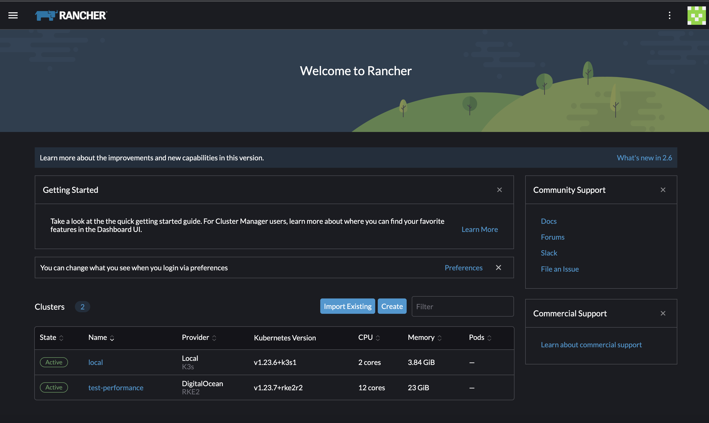

# Rancher Dashboard
Rancher Dashboard is the UI that powers [Rancher](https://www.rancher.com/products/rancher).

Rancher Dashboard supports an extension mechanism that allows developers to independently provide additional functionality to Rancher. You can learn more from our [Rancher Extensions Docs](https://extensions.rancher.io).

# What is it?

Rancher Dashboard provides a sophisticated UI for managing Kubernetes clusters and Workloads.

## Internal Developer Docs

These docs are intended only for Dashboard UI developers.

If you're building extensions, please see: https://extensions.rancher.io.

For internal documentation, see [Rancher UI Internal Documentation](https://extensions.rancher.io/internal/docs).

## Contributing

We welcome external contributions - please refer to the internal documentation above.

License
=======
Copyright (c) 2014-2025 [SUSE](https://www.suse.com)

Licensed under the Apache License, Version 2.0 (the "License");
you may not use this file except in compliance with the License.
You may obtain a copy of the License at

[http://www.apache.org/licenses/LICENSE-2.0](http://www.apache.org/licenses/LICENSE-2.0)

Unless required by applicable law or agreed to in writing, software
distributed under the License is distributed on an "AS IS" BASIS,
WITHOUT WARRANTIES OR CONDITIONS OF ANY KIND, either express or implied.
See the License for the specific language governing permissions and
limitations under the License.
