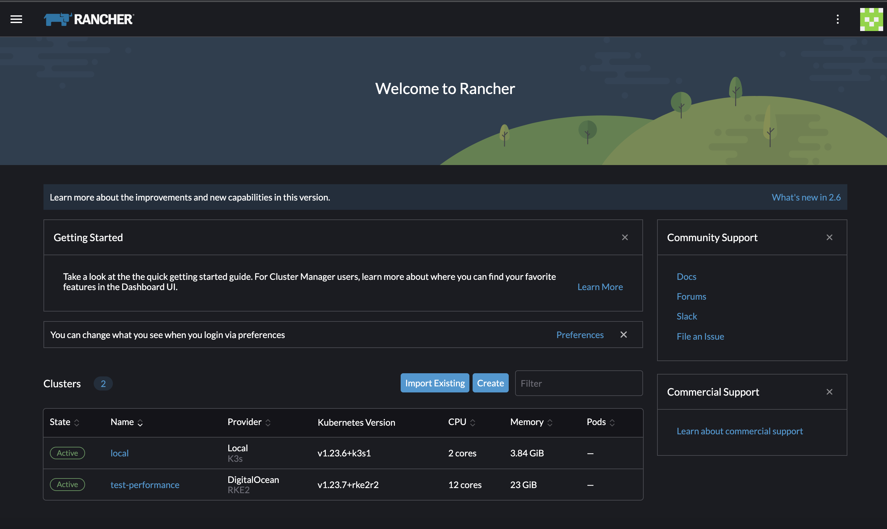

# Rancher Dashboard

Rancher Dashboard is the UI that powers [Rancher](https://www.rancher.com/products/rancher).

Developer documentation and documentation for our UI components is available here - [Rancher UI Devkit](https://rancher.github.io/dashboard/).

Rancher Dashboard supports an extension mechanism that allows developers to build there own extensions that can be developed independently of Rancher and loaded into a deployed Rancher installation to extend its functionality. You can learn more from our [Rancher Extensions Docs](https://rancher.github.io/dashboard/extensions/introduction).

# What is it?

Rancher Dashboard provides a sophisticated UI for managing Kubernetes clusters and Workloads.

For more information, see our [UI Walk-through documentation](https://rancher.github.io/dashboard/getting-started/ui-walkthrough).

## Developer Docs

- [Rancher UI Devkit](https://rancher.github.io/dashboard/) - for our documentation home
- [Developer Quick Start documentation](https://rancher.github.io/dashboard/getting-started/quickstart) - to get the Rancher Dashboard running
- [Rancher Extensions Docs](https://rancher.github.io/dashboard/extensions/introduction) - to get started with Rancher Extensions 

## Contributing

For developers, after reading through the introduction on this page, head over to our [Getting Started](https://rancher.github.io/dashboard/getting-started/concepts) guide to learn more.

License
=======
Copyright (c) 2014-2023 [Rancher Labs, Inc.](http://rancher.com)

Licensed under the Apache License, Version 2.0 (the "License");
you may not use this file except in compliance with the License.
You may obtain a copy of the License at

[http://www.apache.org/licenses/LICENSE-2.0](http://www.apache.org/licenses/LICENSE-2.0)

Unless required by applicable law or agreed to in writing, software
distributed under the License is distributed on an "AS IS" BASIS,
WITHOUT WARRANTIES OR CONDITIONS OF ANY KIND, either express or implied.
See the License for the specific language governing permissions and
limitations under the License.
