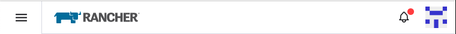
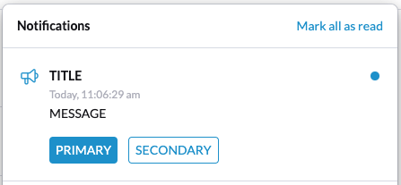

# Notification Center API

> &#x26a0;&#xfe0f; Documentation in this directory is intended for internal use only. Any information contained here is unsupported.

> For now, developers can use the Notification Centre via the VueX store. In the future, we will add an API for this, that will be fully supported as part of the UI Extensions API.

The Notification Center adds a 'bell' icon in the top-right of the Rancher Manager UI which supports a history of application notifications. When there are unread notifications, then bell icon shows a red dot, for example:



> The existing `growl` store is deprecated - notifications added to the notification center of certain notification levels will automatically show growls.

> See [Best Practice](#notification-best-practice) for best practice for notifications

## Adding a Notification

> Note: Types are defined in `@shell/types/notifications`

There is a new VueX store with actions under the `notifications` store.

```
  store.dispatch('notifications/add', notification);
```

Where `notification` is of type `Notification`. The properties on this type are:

|Field|Purpose|
|---|---|
|level|Notification level|
|title|Title to be displayed in the notification|
|message|Message to be shown in the notification (optional)|
|progress|Progress (0-100) for notifications of type `Task` (optional)|
|primaryAction|Primary action to be shown in the notification (optional)|
|secondaryAction|Secondary to be shown in the notification (optional)|
|id|Unique id (optional)|
|preference|User Preference tied to the notification (optional) (the preference will be updated when the notification is marked read)|

The `level` specifies the importance of the notification and determines the icon that is shown in the notification. You should use the `NotificationLevel` type from `@shell/types/notifications`.

|Level|Purpose|
|---|---|
|Announcement|An announcement (like info but shows the announcement icon|
|Task|A task that is underway (will show progress bar if the `progress` field is et|
|Info|Information notification|
|Success|Notification that something has completed successfully|
|Warning|Notification of a warning|
|Error|Notification of an error|

Example notification of type `Announcement`:



Note that the `id` field is optional - if not specified, the notification will be assigned a unique identifier. Using a known identifier is only really required if you wish to be able to look up a notification by a known identifier OR you wish to be able to update a notification after being added.

> Note: Be careful not to include sensitive information in notifications, since these are persisted to the browser's local storage

### Actions

Notifications can contain one of both of a `Primary` of `Secondary` action. These are shown as buttons in the notification UI.

These actions can be specified by the `primaryAction` and `secondaryAction` fields. The type of both of these if `NotificationAction`.

`NotificationAction` contains two fields:

|Field|Purpose|
|---|---|
|label|Button label for the action|
|target|HREF link that will be opened in a new tab when the action is invoked|

Currently actions only support opening a specified link in a new browser tab when the corresponding button is clicked.

# Updating a Notification

A notification can be updated by dispatching the action:

```
  store.dispatch('notifications/update', notification);
```

Where `notification` is of type `Notification`.

Note that `notification` MUST include an `id` field that specifies the identifier of an existing notification.

A typical use-case for updating a notification is to update the `progress` status of a `Task` notification.

# Linking a Notification to a User Preference

In some cases (e.g. remembering if a user has read the release notes), we wish to link a notification to a user preference, so that
when the user marks a notification as read or unread, it updates the preference accordingly.

This can be done via the optional `preference` field on the `Notification` type which is of type `NotificationPreference`.

This has the following fields:

|Field|Purpose|
|---|---|
|key|ID of the user preference|
|value|Value to store in the user preference when the corresponding notification is marked as read|
|unsetValue|Value to store in the user preference when the corresponding notification is marked as unread (optional - when not specified, the preference will be set to an empty string)|

# Adding Notifications in a UI Extension

One common use case is to add/manage notifications at load time in a UI Extension.

To do this, you can leverage the `onReady` UI Extension hook that is invoke when the user logs in and the notifications have been loaded and initialized.

This can be set in the `init` function of your UI Extension with the `setOnReady` function, for example:

```
import { IPlugin } from '@shell/core/types';

// Init the package
export default function(plugin: IPlugin) {

  // ... Other initialization code ...

  // Set the `onReady` function to allow us to add a notification at log in
  plugin.setOnReady(async (store: any) => {
    await store.dispatch('notifications/add', { <notification> });
  });
}
```

# Notification Best Practice

When adding notifications, please take into consideration the following best practice:

**Notification level:**

- Information = blue “info” symbol, to be used when we want to inform on low-interest topics. E.g. “Welcome to Rancher v2.8"
- Announcement = blue “megaphone” symbol, to be used when we want to inform on high-interest topics - news, updates, changes, scheduled maintenance, etc. E.g. “New version available!”
- Process = blue “loading” symbol, to be used when we want to inform on a process taking place - on-going actions that might take a while. E.g. “Cluster provisioning in progress”
- Confirmation = green “checkmark” symbol, to be used when we want to confirm a successful action was completed. E.g. “Cluster provisioning completed”
- Warning = orange “warning” symbol, to be used when we want to warn about a potential risk. E.g. “Nodes limitation warning”
- Alert = red “alert” symbol, to be used when we want to alert on a confirmed risk. E.g. “Extension failed to load”

**Notification title (text):**

Keep it concise, relevant and direct

**Notification message (body) **

The content of the notification.

This should expand on the notification title by providing further details about the notification.
