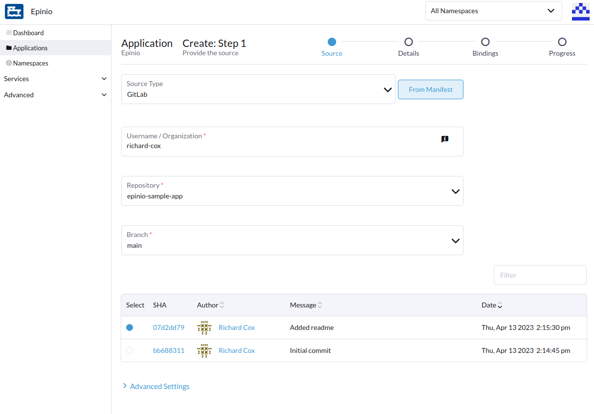
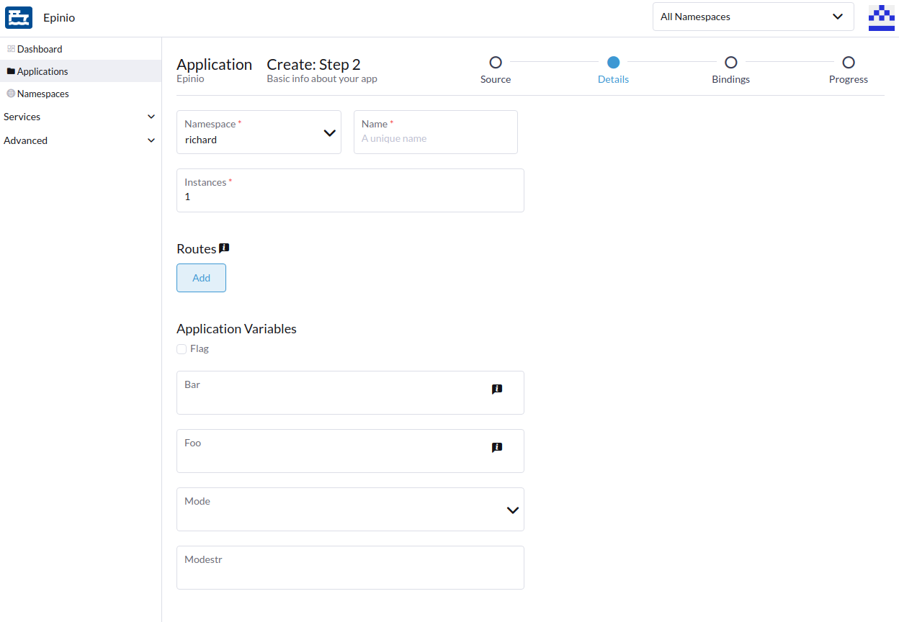
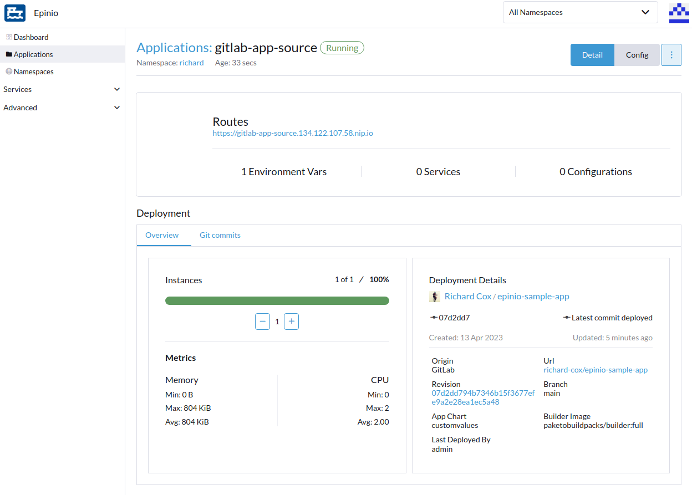
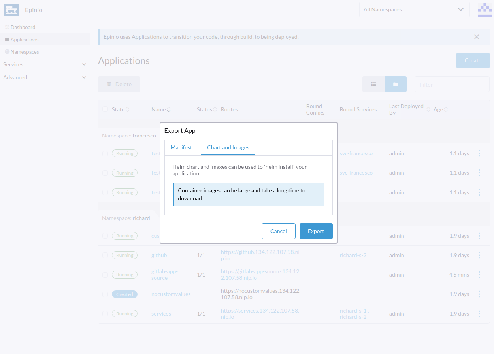

## Epinio Applications Workflow Updates

Based on user feedback, we've made 4 improvements to the Epinio UI which make it easier to create, update and export applications.

Epinio now supports Gitlab directly in the application deployment creation workflow. 
Users can create application deployments from Gitlab repositories:

---

The application deployment creation UI now supports custom application variables (based on schema-ish metadata). Where possible, the UI informs the user about boundaries such as min/max allowed values.

---

It's now possible to change the source of an existing application. For example, if an application was initially deployed from a GitHub repository, we can now update the source to point to Gitlab instead.

---

Users can export applications as a helm chart and corresponding container image(s). 

