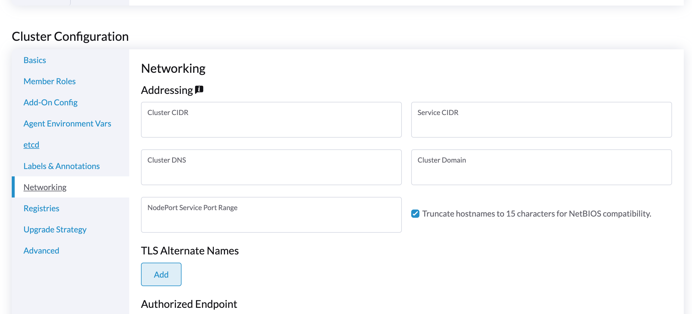
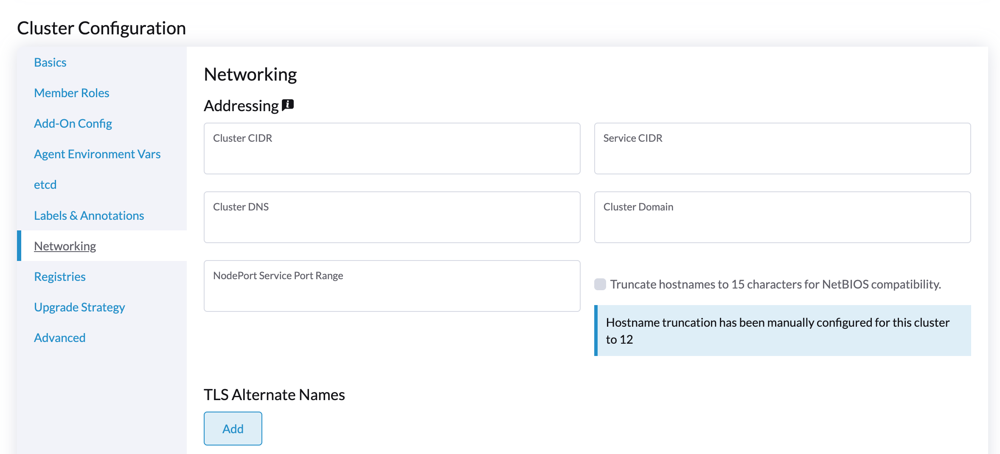
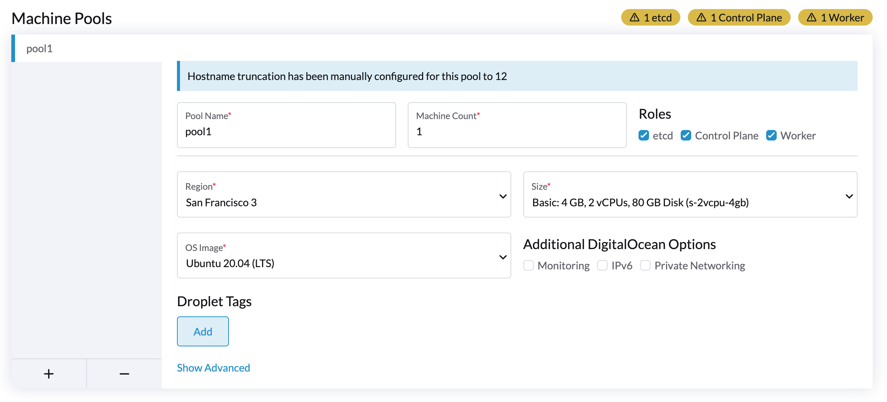

## Truncating Hostnames

Kubernetes allows for 63 character hostnames but for systems running Windows there is a hard limit of 15 characters. We've added a checkbox to the cluster creation UI which will tell the Rancher server to truncate the machine pool hostnames to 15 character when creating a cluster.

Users will be notified when editing clusters or singular machine pools with settings beyond those supported by the UI. Changing the truncation setting after creation is currently not supported.

