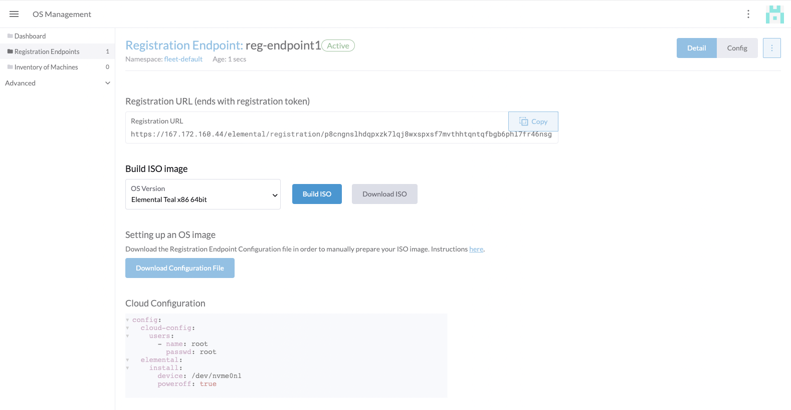
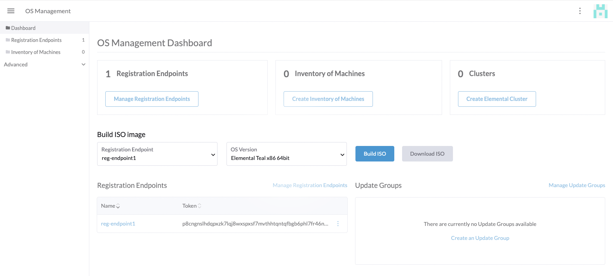

## Building ISO Images

Currently, when users want to add an Edge machine to an Elemental cluster they have to create an ISO image which is properly configured with the registration endpoint information by hand. 

To simplify this workflow we've added the ability to build an ISO image preconfigured for a given Elemental endpoint. After booting this image, the machine will be available to Rancher for inclusion in a cluster.

Users can also build images directly on the dashboard for any registration endpoint.

