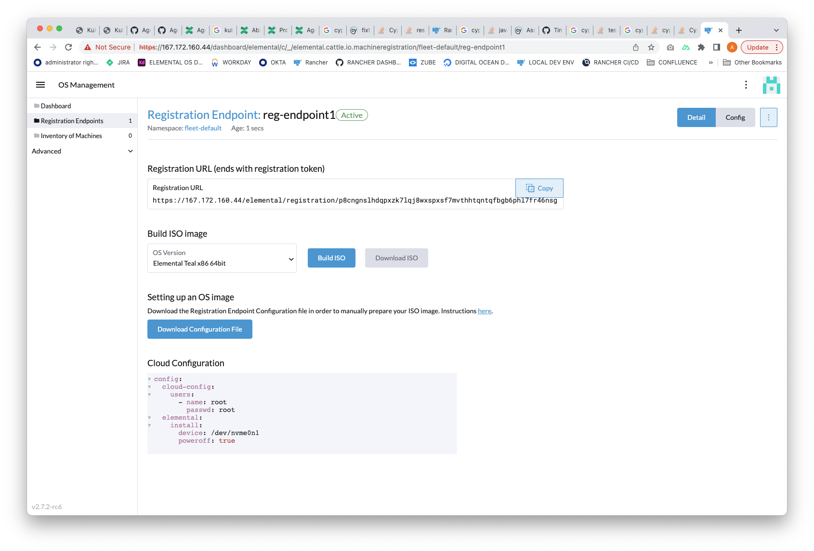

In order to easae the creation of Elemental clusters we've added the ability to build an iso image preconfigured for a given Elemental endpoint. At boot, the preconfigured iso will be available to Rancher for inclusion in a cluster.

