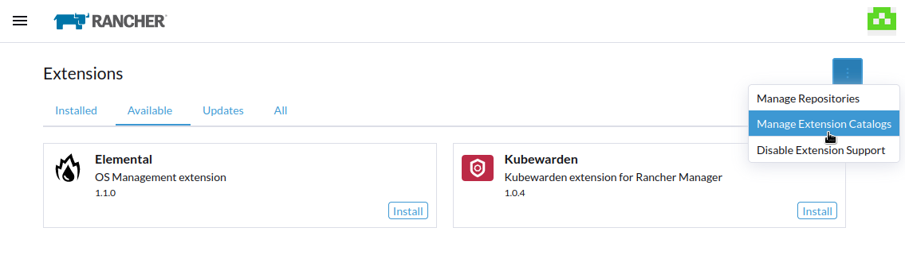
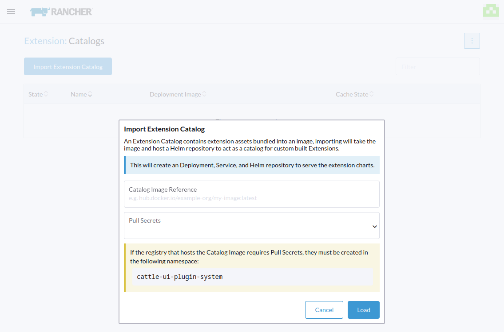
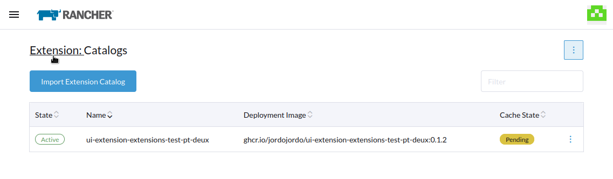
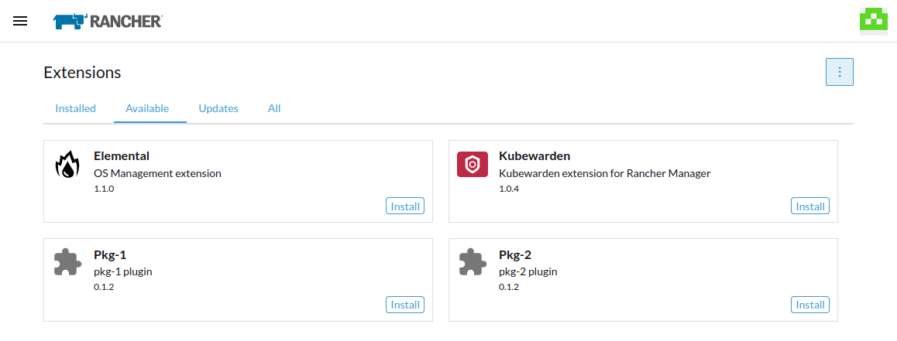

# Air-gapped Environments

In order to load an extension within an air-gapped instance of Rancher, you will need to import an Extension Catalog Image to provide the extension assets, which are then served within the "Available" tab of the Extensions page and can be installed as normal.

The Extension Catalog Image (ECI) contains the assets of each extension which give the [ui-plugin-operator](https://github.com/rancher/ui-plugin-operator) the necessary files to load an extension into the Rancher Dashboard. 

We have implemented an action within the Extensions page to take care of the heavy lifting for you by creating the necessary resources.

> Note: The ECI is comprised of a hardened [SLE BCI](https://registry.suse.com/bci/bci-base-15sp4/index.html) image with an [NGINX](https://nginx.org/en/) service which supplies the minified extension files.

## Prerequisites

Loading an extension into an air-gapped envrionment requires a few prerequisites, namely:

- The Extension needs to be bundled into the ECI
- A registry to house the ECI
- Access to this registry within the air-gapped Cluster

> Note: Any Secrets that are required to authenticate with the registry ***MUST*** be created in the `cattle-ui-plugin-system` namespace. 

## Building the Extension Catalog Image

Currently there are two options available for building your extension into an ECI. You can use the predefined Github Workflow, if you plan on housing the extension within a Github repository, or you can manually build and publish your extension to a specified registry.

In either case, the ECI will need to be published to a registry that is accessible from the air-gapped cluster.

### Github Workflow

If using the provided Github workflow with your extension, the extension will be built and published for each package version to the [Github Container Registry](https://docs.github.com/en/packages/working-with-a-github-packages-registry/working-with-the-container-registry) (`ghcr`).

> Note: The extension image that is built will contain Helm charts for each subsequent package (i.e. `./pkg/<EXTENSION_NAME>`). In order to release a new version of a package, the root extension will need to be published with an updated tag within `./package.json`.

Once the extension has been published you will then be able to pull, tag, and push the ECI into your desired registry.

From a machine that has access to both the desired registry and `ghcr.io`, pull the image:

```sh
docker pull ghcr.io/<ORGANIZATION>/ui-extension-<REPO>:<TAG>
```

Then re-tag and push the image to your registry:

```sh
docker tag ghcr.io/<ORGANIZATION>/ui-extension-<REPO>:<TAG> <MY_REGISTRY>/<ORGANIZATION>/ui-extension-<REPO>:TAG
docker push <MY_REGISTRY>/<ORGANIZATION>/ui-extension-<REPO>:TAG
```

Proceed to the [Importing the Extension Catalog Image](#importing-the-catalog-image) step.

### Manual Build

The ECI can also be built manually using the `yarn publish-pkgs -c` command.

___Building Prerequisites___

This method requires a few tools to be installed:

- [make](https://www.gnu.org/software/make/)
- [docker](https://docs.docker.com/get-docker/)
- [go](https://go.dev/dl/)
- [nodejs](https://nodejs.org/en/download) ( >= `12.0.0` < `17.0.0` )
- [yarn](https://yarnpkg.com/getting-started/install)
- [jq](https://stedolan.github.io/jq/)
- [yq](https://github.com/mikefarah/yq/#install) ( >= `4.0.0` )
- [helm](https://helm.sh/docs/intro/install/) ( >= `3.0.0` )

___Running the Build Manually___

To build, simply run the following:

```sh
yarn publish-pkgs -cp -r <REGISTRY> -o <ORGANIZATION>
```

| Option | Argument | Description |
| -- | ---- | -------- |
| `-c` | | specifies the container build | 
| `-p` | | Option to push the built image into the registry |
| `-r` | `<registry>` | specifies the registry where the image will be housed |
| `-o` | `<organization>` | specifies the organization namespace for the registry |

Reference the [Manually Publishing an Extension Catalog Image](../publishing#manually-publishing-an-extension-catalog-image) step in the Publishing section for more information.

## Importing the Extension Catalog Image

Importing the ECI is fairly straightforward, you will need the Catalog Image Reference from your registry and any secrets necessary to authenticate with the registry.

> Note: Any Secrets that are required to authenticate with the registry ***MUST*** be created in the `cattle-ui-plugin-system` namespace. 

Within the Extensions page, select "Manage Extension Catalog" from the action menu in the top right. From here you will be able to see any Extension Catalog Images loaded previously along with their state, name, image used for the deployment, and cache state (used by the `ui-plugin-operator`).

To import an ECI, click on the "Import Extension Catalog" button:



Fill out the form within the modal with your Catalog Reference Image URI (for example: `<MY_REGISTRY>/<ORGANIZATION>/ui-extension-<REPO>:TAG`) and any secrets necessary to pull the image.

> Note: If the registry is not supplied within the URI, it will default to `hub.docker.io`.

> Note: If the version of the image is omitted, this will default to `latest`.



The resources mentioned [above](#air-gapped-environments) will be created. You can navigate back to the main Extensions page by selecting breadcrumb link for "Extension" button from the header title in the top left of the screen.



Within the "Available", tab the newly imported extensions are now available to be installed normally.


