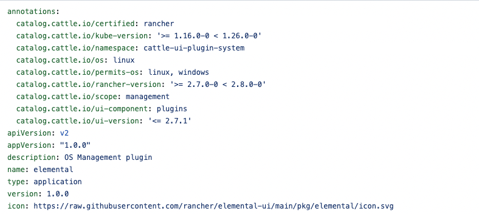

# Version compatibility

There are several ways to "control" an Extension version compatibility with several parameters such as Rancher version, Kubernetes version and Rancher UI/Dashboard version.
It can be achieved by using annotations on the `index.yaml` and `chart.yaml` files generated by the [publish](../publishing.md) procedure.

Here are the annotations you can modify:

| Annotation | Value | Rancher Version support (Minimum version) | Description |
| --- | --- | --- | --- |
| `catalog.cattle.io/kube-version` | `Range` | v2.7.0 | Semver range of Kubernetes versions the extension supports. Prevents loading on clusters running a version outside the range. |
| `catalog.cattle.io/rancher-version` | `Range` | v2.7.0 | Semver range of Rancher Manager versions the extension supports. Prevents loading on a Rancher version outside the range. |
| `catalog.cattle.io/ui-extensions-host` | `String` | v2.7.0 | Host application the extension targets (e.g. `rancher-manager`). Prevents loading when the host doesn't match. |
| `catalog.cattle.io/ui-extensions-version` | `Range` | v2.9.0 | Semver range of the Extensions API (Shell package) the extension is built against for compatibility purposes. Some Rancher versions might bump it to a fixed major due to architectural changes: 2.8 → v1, 2.9 → v2, 2.10 → v3. Pin to the major you built against (e.g. `>= 3.0.0 < 4.0.0`). **Mandatory from Rancher 2.10 onwards — extensions without this annotation will not be loaded.** |

All annotations will prevent the loading of an extension into Rancher.