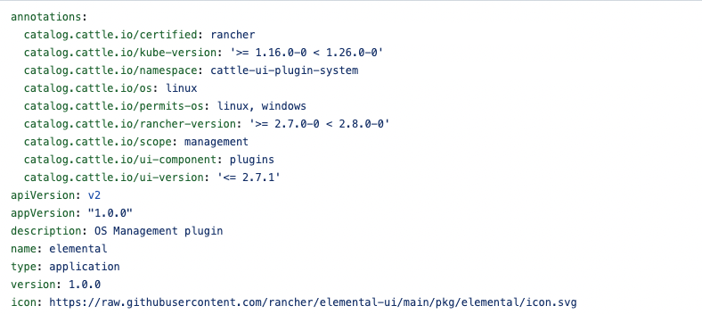
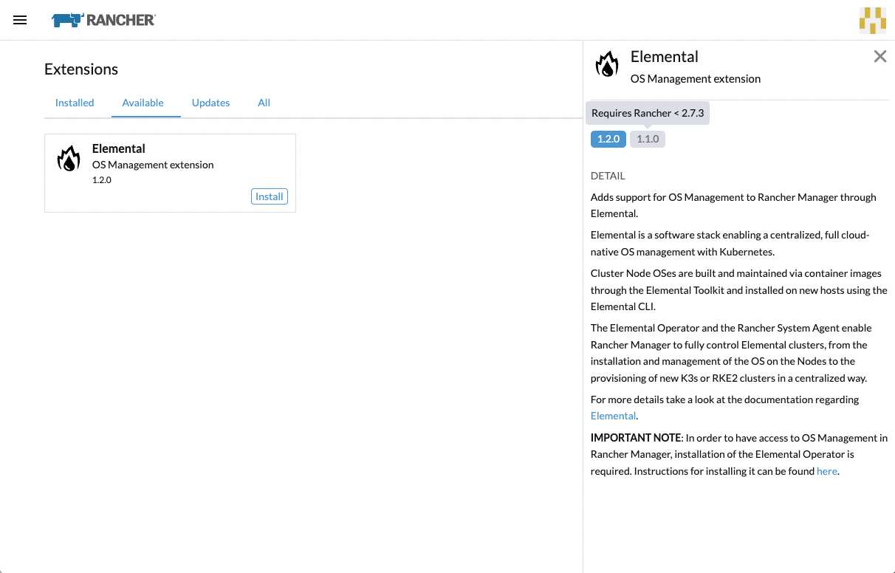

# Version compatibility

There are several ways to "control" an Extension version compatibility with several parameters such as Rancher version, Kubernetes version and Rancher UI/Dashboard version.
It can be achieved by using annotations on the `index.yaml` and `chart.yaml` files generated by the [publish](../publishing.md) procedure.

Here are the annotations you can modify:

| API | Rancher Version support (Minimum version)| Effect
| --- | --- | --- |
| `catalog.cattle.io/kube-version` | v2.7.0 | Defines a possible minimum and maximum Kubernetes version for the extension to work with. Prevents extension version from being loaded on the UI
| `catalog.cattle.io/rancher-version` | v2.7.0 | Defines a possible minimum and maximum Rancher version for the extension to work with. Prevents extension version from being loaded on the UI
| `catalog.cattle.io/host` | v2.7.0 | Defines the host for the extension, which should have the value `rancher-manager`. Prevents extension version from being loaded on the UI
| `catalog.cattle.io/ui-extensions-version` | v2.9.0 | Defines a possible minimum and maximum Extensions API version for the extension to work with. Prevents extension version from being loaded on the UI
| `catalog.cattle.io/ui-version` | v2.7.3 | Defines a possible minimum and maximum Rancher Dashboard version for the extension to work with. Extension version will be loaded but will appear as disabled

 
**NOTE: The annotation `catalog.cattle.io/ui-extensions-version` will become mandatory from Rancher 2.10 and onwards. If the annotation is not present on a given extension Helm Chart, the extension itself will not be loaded**
 
All annotations will prevent the loading of an extension into Rancher apart from `catalog.cattle.io/ui-version`, which will have a sligthly different behaviour and allow for the extension version to be loaded, but will disable it on the Install, Upgrade and Rollback scenarios, where that given version will not appear on those dropdowns and also the extension version button on the side panel will be disabled and will show a tooltip on hover with the information, such as:

