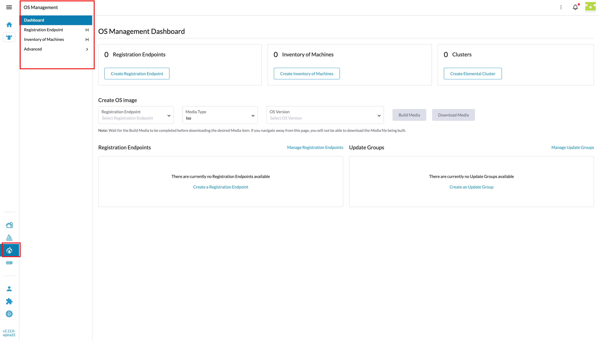
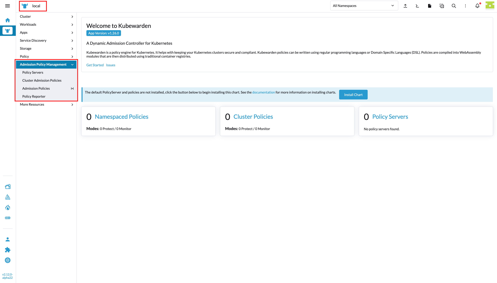

# Concepts

## Plugin lifecycle

When Rancher loads an extension, it calls the extension's **default export function**, passing an `IPlugin` instance:

```ts
export default function(plugin: IPlugin) {
  // register everything here
}
```

This function is called once at load time. All products, routes, and UI injections must be registered inside it.

---

## IPlugin

`IPlugin` (imported from `@shell/core/types`) is the object through which your extension registers everything it contributes. The key properties and methods are:

| Property / Method | Purpose |
|---|---|
| `plugin.metadata` | Set display name, version, and description shown in the Extensions marketplace |
| `plugin.addProduct(def)` | Register a top-level product (loads your `product.ts`) |
| `plugin.addRoutes(routes)` | Register Vue Router routes for your product's pages |
| `plugin.DSL(store, productName)` | Get the DSL helper functions scoped to a named product |

UI injection methods (`addTab`, `addPanel`, `addAction`, `addCard`, `addTableColumn`) are documented individually in the [Extensions API](./overview.md).

---

## The DSL

`plugin.DSL(store, productName)` returns a set of helpers that define a product's navigation structure. "DSL" stands for Domain-Specific Language — a thin layer that translates your product config into the format Rancher's router and nav system expects.

| Helper | Purpose |
|---|---|
| `product(config)` | Register the product: its icon, which store it uses, and its default landing route |
| `basicType(names)` | Add page names to the product's side menu |
| `virtualType(config)` | Define a fully custom page (not backed by a Kubernetes resource) |
| `configureType(resource, config)` | Configure how a Kubernetes resource is displayed as a page in your product |

These helpers work together: `virtualType` or `configureType` defines a page; `basicType` makes it visible in the side menu.

---

## What is a top-level product?

A "top-level product" inside the Rancher UI is a product that interacts with the Rancher cluster and **may** interact with one or several downstream clusters, depending on the code you develop for it. 

When you register a `product` using the example below:

```
// registering a top-level product
product({
  icon: 'gear',
  inStore: 'management',
  weight: 100,
  to: {
    name: `${ YOUR_PRODUCT_NAME }-c-cluster-${ CUSTOM_PAGE_NAME }`,
    params: {
      product: YOUR_PRODUCT_NAME,
      cluster: BLANK_CLUSTER
    }
  }
});
```

You will be registering a new app/product that is global to the whole Rancher UI, much like `Fleet` or `Cluster Management`, and as a side-effect an icon will appear on the main side bar of Rancher:



All the pages that you register inside this product will appear as links on it's dedicated sub-menu providing that all the correct functions are used.

## What is a cluster-level product?

A "cluster-level product" inside the Rancher UI is a product that interacts with the Rancher cluster and can **only** interact with one downstream cluster.

When you register a `product` using the example below:

```
// registering a cluster-level product
product({
  icon:    'gear',
  inStore: 'cluster', // this is what defines the extension as a cluster-level product
  weight:  100,
  to:      {
    name:   `c-cluster-${ YOUR_PRODUCT_NAME }-${ CUSTOM_PAGE_NAME }`,
    params: { product: YOUR_PRODUCT_NAME }
  }
});
```

You will be registering a new app/product that only appears in the context of "Cluster explorer", like:



All the pages that you register inside this product will appear as links on it's dedicated sub-menu providing that all the correct functions are used.


## Overview on routing structure for Rancher Dashboard

To become familiar with routing on VueJS and route definition we recommend that you should give a read about the [Essentials on Vue Router](https://router.vuejs.org/guide/) and also the definition of a [Vue Router route](https://router.vuejs.org/api/).

Rancher Dashboard follows a specific route pattern that needs to be fulfilled in order for Extensions to work properly with the current overall logic of the application. That pattern needs on the url path to include which `product` we are trying to load and which `cluster` we are using.

As example of an existing route, say the Fleet product, let's look at the current url structure for it:

```ts
<-YOUR-RANCHER-INSTANCE-BASE-URL->/c/_/fleet
```

In terms of the route definition (Vue Router), we would translate this url to:

```ts
const clusterManagerRoute = {
  name: 'c-cluster-product',
  path: 'c/:cluster/:product',
  params: {
    cluster: '_',
    product: 'fleet'
  },
  meta: {
    cluster: '_',
    product: 'fleet'
  }
}
```

As we can see from the example above, we have defined on the `path` the wildcards for `cluster` and `product`. Also we can see the definition of `params` property, which is needed for internal app navigation and where we define the `cluster` value as `_` , which in terms of the app context this means that we are using a "blank cluster" which translates that the app doesn't need to care about the cluster context for the Fleet product to run. Also we are defining `product` value as `fleet`, which in turn tells the app  what is the correct product to load.

With this pattern of wildcards and `params` in mind, then how does the route structure should look like for a top-level Extension product? In short, we recommend following this pattern:

```ts
const YOUR_EXT_PRODUCT_NAME = 'myExtension';

const baseRouteForATopLevelProduct = {
  name: `${ YOUR_EXT_PRODUCT_NAME }-c-cluster`,
  path: `/${ YOUR_EXT_PRODUCT_NAME }/c/:cluster`,
  params: {
    cluster: '_',
    product: YOUR_EXT_PRODUCT_NAME
  },
  meta: {
    cluster: '_',
    product: YOUR_EXT_PRODUCT_NAME
  }
}
```

As we can see we have dismissed the `product` wildcard on the `path` and replaced it with the Extension product name to make it unique. With the `product` param we make sure that the is taken to the correct product at all time.
This structure on the above example ensures that all the wiring needed for the Extension to work properly on Rancher Dashboard is done. There's even the case where the wildcard `resource` needs to be defined in order to display information about Kubernetes resources or custom CRDs. An example of a resource route in a top-level Extension product would be:

```ts
const YOUR_EXT_PRODUCT_NAME = 'myExtension';
const RESOURCE_NAME = 'my-resource-name';

const routeForATopLevelProductResource = {
  name: `${ YOUR_EXT_PRODUCT_NAME }-c-cluster-resource`,
  path: `/${ YOUR_EXT_PRODUCT_NAME }/c/:cluster/:resource`,
  params: {
    cluster: '_',
    product: YOUR_EXT_PRODUCT_NAME
    resource: RESOURCE_NAME
  },
  meta: {
    cluster: '_',
    product: YOUR_EXT_PRODUCT_NAME
  }
}
```

With this overview on how routing works in Rancher Dashboard, we should be ready to cover the registration of custom pages, resource pages and general route definition. For more detailed information on **top-level product routing**, check this page **[here](./nav/routing.md#routes-definition-for-an-extension-as-a-top-level-product)**.

If you are interested in **cluster-level product routing**, check this page **[here](./nav/routing.md#routes-definition-for-an-extension-as-a-cluster-level-product)**.

