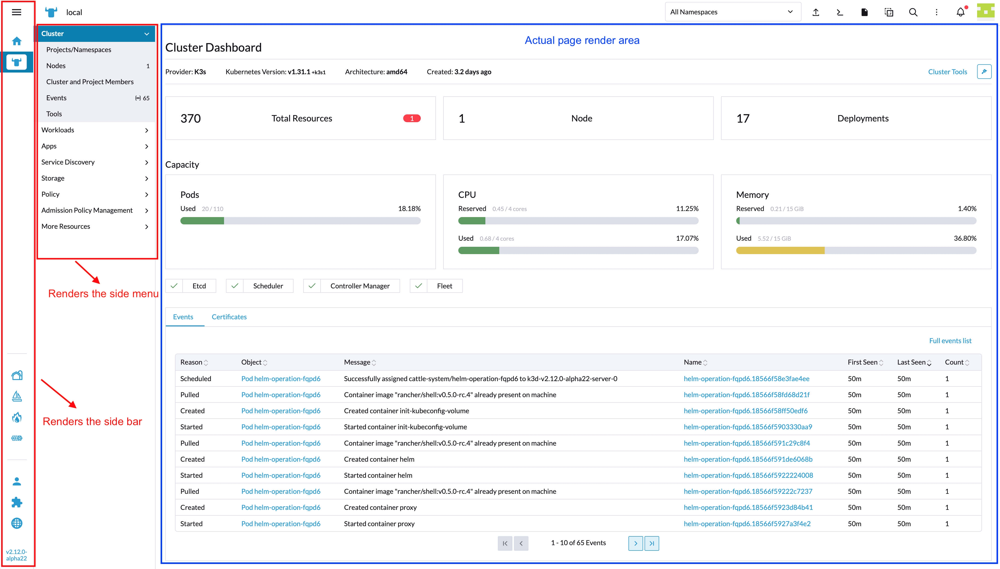
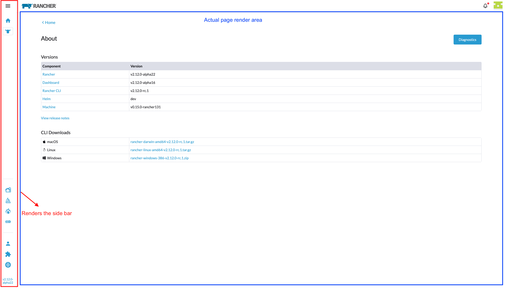

# Page templates

When you create a page, either a [Custom Page](./custom-page.md) (`virtualType`) or a [Resource Page](./resource-page.md) (`configureType`), you can make use of different templates. By default it will use the `default` layout, but there are two different templates available:

## default template



The `default` template always renders the main side bar **and** the side menu, leaving a smaller area marked in blue (check screenshot above) for the actual page render.


## plain template



The `plain` template always renders the main side bar but **without** any side menu, leaving a slightly bigger area, when compared with the "default" template, marked in blue (check screenshot above) for the actual page render.

## How to use a template

How does a developer make use of a template? 

Let's make use of the example of a Top-level product. When defining the [routes to be added to the Vue Router](./routing.md#top-level-product---adding-your-defined-routes-to-vue-router), instead of having each entry of the array of routes as a "simple" route object like the example on the previous link, you'll need to slighty tweak the object format to add the `parent` property, which **must** match the template names, and also add a `route` property, such as:

```ts
const BLANK_CLUSTER = '_';

import MyCustomPage from '../pages/myCustomPage.vue';

const YOUR_PRODUCT_NAME = 'myProductName';
const CUSTOM_PAGE_NAME = 'page1';

const routes = [
  // this is an example of a custom page if you wanted to register one
  {
    parent: 'plain',
    route: {
      name:      `${ YOUR_PRODUCT_NAME }-c-cluster-${ CUSTOM_PAGE_NAME }`,
      path:      `/${ YOUR_PRODUCT_NAME }/c/:cluster/${ CUSTOM_PAGE_NAME }`,
      component: MyCustomPage,
      meta:      {
        product: YOUR_PRODUCT_NAME,
        cluster: BLANK_CLUSTER
      },
    }
  }
];

export default routes;
```

For a [Cluster-level product](./routing.md#cluster-level-product---adding-your-defined-routes-to-vue-router) route the logic is the same. The `name`, `path` and `meta` properties just need to follow the appropriate structure for this type of product. Here's an example:

```ts
import MyCustomPage from '../pages/myCustomPage.vue';

const YOUR_PRODUCT_NAME = 'myProductName';
const CUSTOM_PAGE_NAME = 'page1';

const routes = [
  // this is an example of a custom page if you wanted to register one
  {
    parent: 'plain',
    route: {
      name:      `c-cluster-${ YOUR_PRODUCT_NAME }-${ CUSTOM_PAGE_NAME }`,
      path:      `/c/:cluster/${ YOUR_PRODUCT_NAME }/${ CUSTOM_PAGE_NAME }`,
      component: MyCustomPage,
      meta:      {
        product: YOUR_PRODUCT_NAME
      }
    }
  }
];

export default routes;
```
