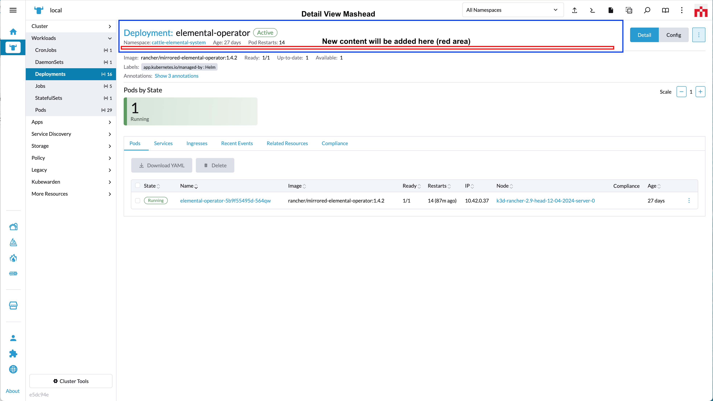
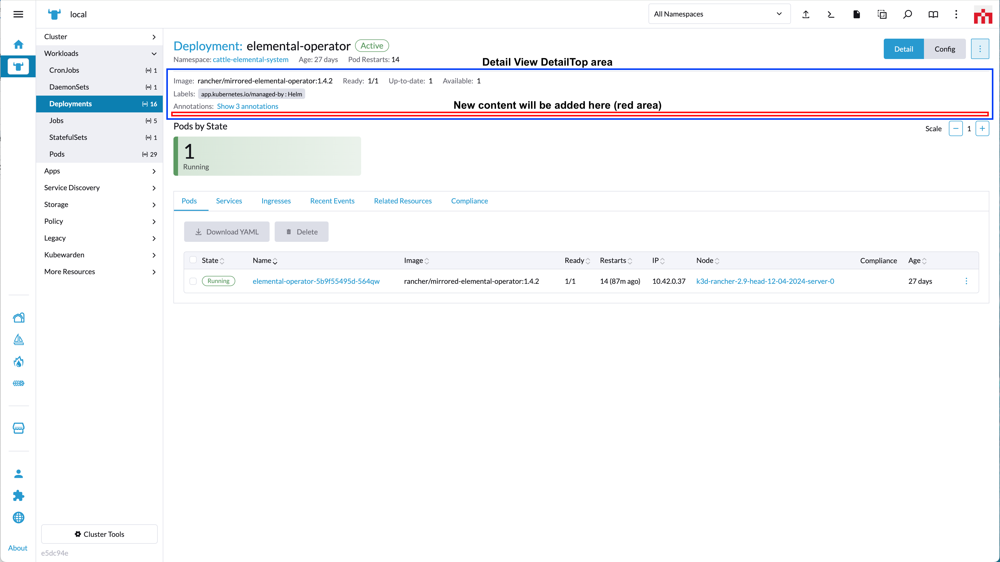

# Panels

A Panel is a defined area in the Rancher UI where custom UI components can be shown.

Panels are added to Rancher via the `addPanel` method.

## addPanel

*(From Rancher version v2.7.2)*

This method adds a panel/content to the UI.

Method:

```ts
plugin.addPanel(where: String, when: LocationConfig, options: Object);
```

_Arguments_

`where` string parameter admissable values for this method:

| Key | Type | Rancher Version | Description |
|---|---|---|---|
|`PanelLocation.DETAILS_MASTHEAD`| String | v2.7.2 | Location for a panel on the Details Masthead area of a Resource Detail page (only for modes `detail`, `edit`, `config` and `create` (v2.7.7)) |
|`PanelLocation.DETAIL_TOP`| String | v2.7.2 | Location for a panel on the Detail Top area of a Resource Detail page (only for modes `detail`, `edit`, `config` and `create` (v2.7.7)) |
|`PanelLocation.RESOURCE_LIST`| String | v2.7.2 | Location for a panel on a Resource List View page (above the table area - only for mode `list` (v2.7.2)) |
|`PanelLocation.ABOUT_TOP`| String | v2.13.0 | Location for a panel on the About page of Rancher Dashboard |

<br/>

`when` Object admissable values:

`LocationConfig` as described above for the [LocationConfig object](./common#locationconfig).

<br/>
<br/>

### PanelLocation.DETAILS_MASTHEAD options

*(From Rancher version v2.7.2)*



`options` config object. Admissable parameters for the `options` with `'PanelLocation.DETAILS_MASTHEAD'` are:

| Key | Type | Description |
|---|---|---|
|`component`| Function | Component to be rendered as content on the "detail view" Masthead component |

Usage example for `'PanelLocation.DETAILS_MASTHEAD'`:

```ts
plugin.addPanel(
  PanelLocation.DETAILS_MASTHEAD,
  { resource: ['catalog.cattle.io.clusterrepo'] },
  { component: () => import('./MastheadDetailsComponent.vue') }
);
```

<br/>
<br/>

### PanelLocation.DETAIL_TOP options

*(From Rancher version v2.7.2)*



`options` config object. Admissable parameters for the `options` with `'PanelLocation.DETAIL_TOP'` are:

| Key | Type | Description |
|---|---|---|
|`component`| Function | Component to be rendered as content on the "detail view" detailTop component |

Usage example for `'PanelLocation.DETAIL_TOP'`:

```ts
plugin.addPanel(
  PanelLocation.DETAIL_TOP,
  { resource: ['catalog.cattle.io.clusterrepo'] },
  { component: () => import('./DetailTopComponent.vue') }
);
```

<br/>
<br/>

### PanelLocation.RESOURCE_LIST options

*(From Rancher version v2.7.2)*


`options` config object. Admissable parameters for the `options` with `'PanelLocation.RESOURCE_LIST'` are:

| Key | Type | Rancher Version | Description |
|---|---|---|---|
|`component`| Function | v2.7.2 | Component to be rendered as content above a table on a "list view" |

Usage example for `'PanelLocation.RESOURCE_LIST'`:

```ts
plugin.addPanel(
  PanelLocation.RESOURCE_LIST,
  { resource: ['catalog.cattle.io.app'] },
  { component: () => import('./BannerComponent.vue') }
);
```

<br/>
<br/>

### PanelLocation.ABOUT_TOP options

*(From Rancher version v2.13.0)*


> NOTE: this Panel will only appear on the area designated in the screenshot in the About page of Rancher UI

`options` config object. Admissable parameters for the `options` with `'PanelLocation.ABOUT_TOP'` are:

| Key | Type | Description |
|---|---|---|
|`component`| Function | Component to be rendered as content above a table on a "list view" |

Usage example for `'PanelLocation.ABOUT_TOP'`:

```ts
plugin.addPanel(
  PanelLocation.ABOUT_TOP,
  {},
  { component: () => import('./BannerComponent.vue') }
);
```