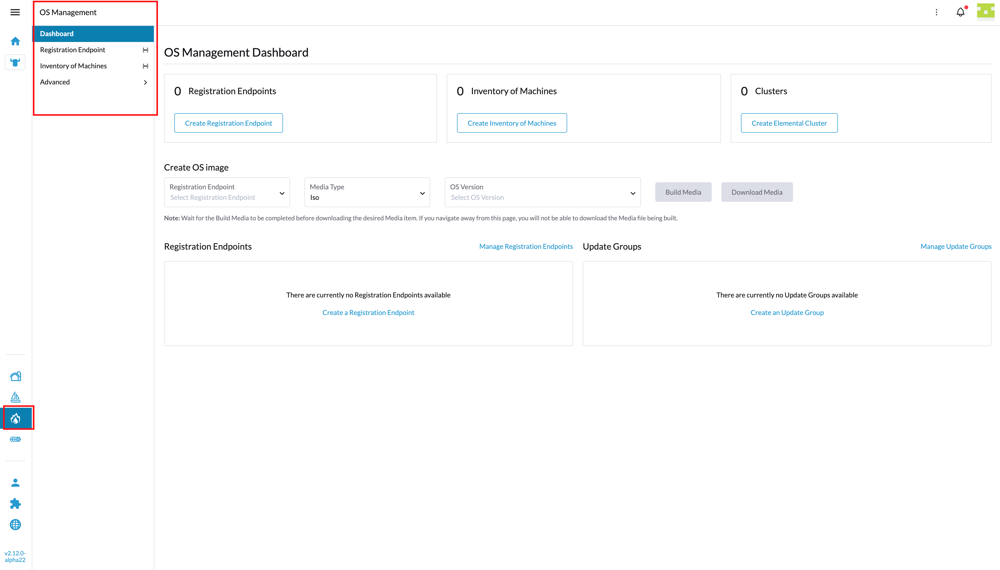
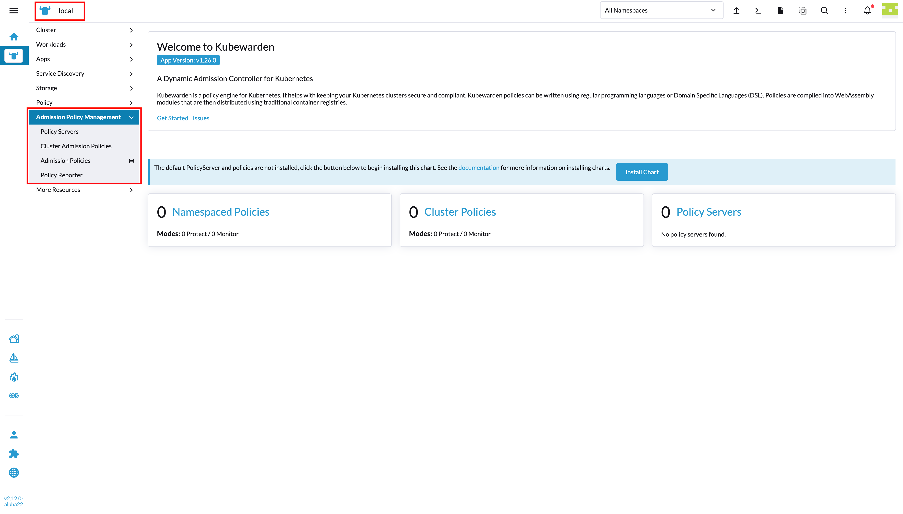

# Product registration

*(Rancher version v2.14.0)*

This page describes the updated way to create or extend products using the extension API. The deprecated flow is preserved in a "Deprecated navigation & pages” section below.

## "addProduct" method
Creates a new product in Rancher (top-level navigation entry, routes, side menu, and pages defined by your config array).



Learn more about the side menu items ordering [here](#ordering-rules-side-navigation-entries-order).

```
plugin.addProduct(productMetadata, productConfig);
```

Where:

| Argument | Type | Description |
| --- | --- | --- |
| `productMetadata` | object | Product name and other relevant metadata like `name`, `label`, `icon`, `weight`, etc |
| `productConfig` | Array | Array of objects that specify the pages to be rendered, like [custom pages](#custom-page), [resource pages](#resource-page), and [groups](#groups-and-overview-pages). |

Example:
```ts
import { importTypes } from '@rancher/auto-import';
import { IPlugin, ProductMetadata, ProductChild } from '@shell/core/types';

export default function init(plugin: IPlugin) {
  // Auto-import model, detail, edit from the folders
  importTypes(plugin);

  // Provide extension metadata from package.json
  // it will grab information such as `name` and `description`
  plugin.metadata = require('./package.json');

  const productMetadata: ProductMetadata = {
    name:  'my-product',
    label: 'My Product',
    icon:  'gear',
  };

  const productConfig: ProductChild[] = [
    {
      name:      'overview', // custom page
      label:     'Overview',
      component: () => import('./components/overview.vue'),
    },
    {
      type:   'provisioning.cattle.io.cluster', // resource page
      label:  'Custom Clusters view',
    },
    {
      name:      'custom-settings', // group with children (only allowed for custom pages)
      label:     'Custom Settings',
      children: [
        {
          name:      'general',
          label:     'General',
          component: () => import('./components/general.vue'),
        },
      ],
    },
  ];

  plugin.addProduct(productMetadata, productConfig);
}
```

### Product Metadata parameters

| Field | Type | Description |
| --- | --- | --- |
| `name` | string | Product identifier (used in route names/paths and translation key `product.<name>`) |
| `labelKey` | string | i18n key; overrides `label` |
| `label` | string | Display label (fallback if translation not found) |
| `icon` | string | Icon name (Rancher icon set) |
| `svg` | module | Optional SVG module instead of icon name |
| `weight` | number | Ordering in top-level menu (higher value = higher in order) |
| `showClusterSwitcher` | boolean | Whether to show cluster switcher the Header (default `false`) |
| `category` | string | Category label (default `global`) |

### Product Config parameters (children inside array)

| Field | Type | Applies to | Description |
| --- | --- | --- | --- |
| `name` | string |[custom page](#custom-page), [group](#groups-and-overview-pages) | Unique page/group id (used in route names) |
| `labelKey` | string |[custom page](#custom-page), [group](#groups-and-overview-pages) | i18n key; overrides `label` |
| `label` | string |[custom page](#custom-page), [group](#groups-and-overview-pages) | Display label (if no `labelKey`) |
| `component` | component loader |[custom page](#custom-page) | Vue component for [custom page](#custom-page). **Not allowed on group parent when extending**. |
| `children` | ProductChildPage[] | [group](#groups-and-overview-pages) | Child pages inside a group (can have their own `component`, `label`, `labelKey`, `weight`) |
| `type` | string | [resource page](#resource-page) | Kubernetes resource type (CRD or built-in) to render via resource views |
| `headers` | object | [resource page](#resource-page) | Table columns configuration. See [Configuring table headers](#configuring-table-headers). |
| `config` | object | [resource page](#resource-page), [custom page](#custom-page) | Advanced configuration object (optional). For resources, use to override default list/create/edit components. See [Custom resource components](#custom-resource-components). |
| `weight` | number | all | Side-menu ordering (higher value = higher in order within scope) |


## "extendProduct" method
Extend an existing product (`StandardProductName`) with extra pages, groups, and resources.



Learn more about the side menu items ordering [here](#ordering-rules-side-navigation-entries-order).

```
plugin.extendProduct(productName, productConfig);
```

Where:

| Argument | Type | Description |
| --- | --- | --- |
| `productName` | string | Product identifier to be extended. Admissible values are refered by `StandardProductName` |
| `productConfig` | Array | Array of objects that specify the pages to be rendered, like [custom pages](#custom-page), [resource pages](#resource-page), and groups. |


Example:
```ts
import { importTypes } from '@rancher/auto-import';
import { IPlugin, ProductChild, StandardProductName } from '@shell/core/types';

export default function init(plugin: IPlugin) {
  // Auto-import model, detail, edit from the folders
  importTypes(plugin);

  // Provide extension metadata from package.json
  // it will grab information such as `name` and `description`
  plugin.metadata = require('./package.json');

  const config: ProductChild[] = [
    {
      name:      'overview', // custom page
      label:     'Overview',
      component: () => import('./components/overview.vue'),
    },
    {
      type:   'upgrade.cattle.io.plan', // resource page
      weight: 80,
    },
    {
      name:      'custom-settings', // group with children (only allowed for custom pages)
      label:     'Custom Settings',
      children: [
        {
          name:      'general',
          label:     'General',
          component: () => import('./components/general.vue'),
        },
      ],
    },
  ];

  plugin.extendProduct(StandardProductName.EXPLORER, productConfig);
}
```

**Extending constraint:** when extending an existing product, a group parent cannot specify `component` (to avoid route-matching conflicts). Put components on the children inside the group.

### Standard Rancher products you can extend

Current enum values for `StandardProductName`:

- `EXPLORER` — Cluster explorer
- `MANAGER` — Cluster management
- `SETTINGS` — Global settings
- `FLEET` — Fleet
- `HARVESTER_MANAGER` — Harvester manager
- `AUTH` — Users & Authentication


### Product child items (config array)

| Field | Type | Applies to | Description |
| --- | --- | --- | --- |
| `name` | string |[custom page](#custom-page), [group](#groups-and-overview-pages) | Unique page/group id (used in route names) |
| `labelKey` | string |[custom page](#custom-page), [group](#groups-and-overview-pages) | i18n key; overrides `label` |
| `label` | string |[custom page](#custom-page), [group](#groups-and-overview-pages) | Display label (if no `labelKey`) |
| `component` | component loader |[custom page](#custom-page) | Vue component for [custom page](#custom-page). **Not allowed on group parent when extending**. |
| `children` | ProductChildPage[] | [group](#groups-and-overview-pages) | Child pages inside a group (can have their own `component`, `label`, `labelKey`, `weight`) |
| `type` | string | [resource page](#resource-page) | Kubernetes resource type (CRD or built-in) to render via resource views |
| `headers` | object | [resource page](#resource-page) | Table columns configuration. See [Configuring table headers](#configuring-table-headers). |
| `config` | object | [resource page](#resource-page), [custom page](#custom-page) | Advanced configuration object (optional). For resources, use to override default list/create/edit components. See [Custom resource components](#custom-resource-components). |
| `weight` | number | all | Side-menu ordering (higher value = higher in order within scope) |

## What Rancher wires in automatically

- **Routes** — `addProduct` creates the Vue Router entries for every [custom page](#custom-page) (previously `virtualType`) and [resource page](#resource-page) (previously `configureType`). Top-level products get paths like `<product>/c/:cluster/<page>`, and resource routes (list/create/edit/show) reuse Rancher’s built-ins. `extendProduct` adds matching `c-cluster-<product>-*` routes so your additions sit inside the existing product.
- **Side menu** — all first-level children are registered as nav items; groups register their children as a second level. Labels/weights are picked from your config; i18n keys are honored.
- **Default landing** — the first child after ordering becomes the product’s default route. If that child is a group, the default is the group page (when it has a component) or the group’s first child.

## Rules and constraints (what’s allowed)

- `type` defines a [resource page](#resource-page); `component` defines a [custom page](#custom-page). Do not set both on the same item.
- `children` turns an item into a [**group**](#groups-and-overview-pages), **except for resource pages, which cannot have children (define a group)**. A group may also provide a `component` to render an overview page. When **extending** an existing product, the group parent **cannot** have a `component` (route-matching conflict).
- `name` is required for [custom pages](#custom-page) and [groups](#groups-and-overview-pages); `type` is required for resource pages.
- Only one set of resource CRUD routes is added per product; each `type` reuses them with the correct meta/params.


## Important concepts

### Custom page

- Represents a [custom page](#custom-page) rendered by your defined **component**.

It's defined by using the property `component`, like:

```ts
{
  name:      'custom-settings',
  label:     'Custom Settings',
  component: () => import('./pages/custom-settings.vue'),
  weight:    90,
}
```

### Resource page

- Represents a Kubernetes resource list/detail/create UI using dashboard resource components. Under the hood, Rancher auto-generates four routes: list, create, detail, and namespaced-detail views.

It's defined by using the property `type`:

```ts
{
  type:      'storage.k8s.io.storageclass',
  label:     'Some custom label',
  weight:    90,
}
```

#### Custom resource components {#custom-resource-components}

By default, resource pages use Rancher's built-in list/create/edit/show components. If you need to override these, pass custom components via `config`:

```ts
{
  type:   'my.custom.io.resource',
  label:  'My Resources',
  config: {
    resourceListComponent:           () => import('./components/MyList.vue'),
    resourceCreateComponent:         () => import('./components/MyCreate.vue'),
    resourceItemComponent:           () => import('./components/MyDetail.vue'),
    resourceItemNamespacedComponent: () => import('./components/MyNamespacedDetail.vue'),
  }
}
```

| Component option | Route | Purpose |
| --- | --- | --- |
| `resourceListComponent` | List view | Renders the list of resources |
| `resourceCreateComponent` | Create view | Renders the create/new resource form |
| `resourceItemComponent` | Detail view | Renders a non-namespaced resource's detail page |
| `resourceItemNamespacedComponent` | Namespaced detail view | Renders a namespaced resource's detail page |

### Groups and overview pages

- A **group** is a **custom page item** with `children`. Its `name` becomes the nav id; it's children are second-level entries.
- A group **can** have a `component` when you create a new product. That component renders an overview page for the group (exact-match route) and is the target when the group is the first item in your config.
- When extending an existing product, group parents must **not** provide `component`; add components to the children instead.

### Ordering rules (side navigation entries order)
- If no `weight` is specified, the order of the `productConfig` items in the array is the order of the menu items appearing on the side menu 
- Top-level product ordering uses `product.weight` (higher floats to the top of the main nav).
- Side-menu ordering uses each item’s `weight` (higher first). Groups respect their own `weight`, and children inside a group respect theirs.
- If you omit weights, Rancher seeds them for you: the smallest explicit weight (or `999` if none) becomes the starting point, and missing weights step downward in the order you declared items. That yields a stable order without having to hand-tune every value.
- The first item after ordering defines the default landing route. If that item is a group without an overview component, its first child becomes the default.

### Products without a side navigation

- Set `product.component` when calling `addProduct` to create a single-page product. Rancher registers a `plain` layout route and skips side-menu registration, so you get a full-bleed page with no sidebar.
- If you pass an empty config without a `component`, Rancher injects a default “Main” page and side-menu entry for you.
## Configuring table headers

When defining [resource pages](#resource-page), you can configure the table columns displayed in the list view using the `headers` property. This provides a simple, type-safe way to customize which columns appear and how they behave.

### Basic usage

```ts
{
  type: 'apps.deployment',
  headers: {
    preset: 'namespaced',  // Adds: state, name, namespace, age
    pagination: 'auto'      // Auto-maps to Steve/SSP equivalents
  }
}
```

### Common patterns

**Using presets:**
```ts
headers: {
  preset: 'namespaced',  // or 'cluster', 'workload', 'storage'
  pagination: 'auto'
}
```

**Explicit columns:**
```ts
headers: {
  columns: ['state', 'name', 'namespace', 'node', 'age'],
  pagination: 'auto'
}
```

**Preset with additional columns:**
```ts
headers: {
  preset: 'namespaced',
  add: ['specType', 'targetPort'],  // Add service-specific columns
  pagination: 'auto'
}
```

### Available presets

- `'namespaced'` — state, name, namespace, age
- `'cluster'` — state, name, age
- `'workload'` — state, name, namespace, type, images, endpoints, age
- `'storage'` — state, name, capacity, storage class, age

### Standard columns

All standard Kubernetes resource columns are available as simple strings (with full TypeScript autocomplete):

**Core:** `'state'`, `'name'`, `'namespace'`, `'age'`, `'node'`, `'version'`  
**Workload:** `'type'`, `'pods'`, `'scale'`, `'workloadImages'`, `'workloadEndpoints'`  
**Storage:** `'persistentVolumeSource'`, `'persistentVolumeClaim'`, `'reclaimPolicy'`, `'storageClassProvisioner'`  
**Network:** `'ingressTarget'`, `'ingressClass'`, `'specType'`, `'targetPort'`, `'selector'`  
**Events:** `'eventType'`, `'eventLastSeenTime'`, `'reason'`, `'message'`  
...and many more (50+ total).

### Customizing columns

For advanced customization (disabling sort/search, custom widths, etc.), see the [detailed headers documentation](./headers.md).
### Deprecated navigation & pages

The [prior DSL-first docs](./deprecated/products-deprecated.md) (manual `product`, `virtualType`, `configureType`, `basicType`, `weightType`, etc.) are kept for reference in the deprecated section. Use them if you need full manual control but these will be **deprecated**.
