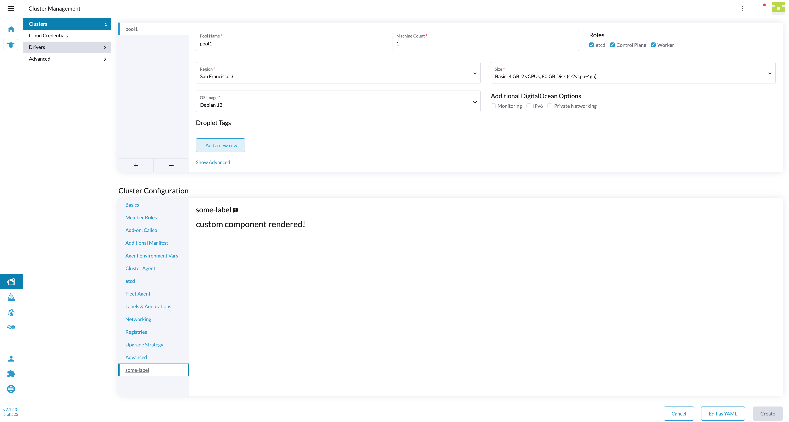

# Tabs

Tabs present custom content inside a new Tab of an existing Tabbed Area section
within the Rancher UI.

Tabs are added to Rancher via the `addTab` method.

## addTab

*(Rancher version v2.7.2)*

This method adds a tab to the UI.

Method:

```ts
plugin.addTab(where: String, when: LocationConfig, options: Object);
```

_Arguments_

`where` string parameter admissable values for this method:

| Key | Type | Description |
|---|---|---|
|`TabLocation.RESOURCE_DETAIL`| String | Location for a Tab on a Resource Detail page |

<br/>

`when` Object admissable values:

`LocationConfig` as described above for the [LocationConfig object](./common#locationconfig).

<br/>
<br/>

### TabLocation.RESOURCE_DETAIL options


`options` config object. Admissable parameters for the `options` with `'TabLocation.RESOURCE_DETAIL'` are:

| Key | Type | Description |
|---|---|---|
|`name`| String | Query param name used in url when tab is active/clicked |
|`label`| String | Text for the tab label |
|`labelKey`| String | Same as "label" but allows for translation. Will superseed "label" |
|`weight`| Int | Defines the order on which the tab is displayed in relation to other tabs in the component |
|`showHeader`| Boolean | Whether the tab header is displayed or not |
|`tooltip`| String | Tooltip message (on tab header) |
|`component`| Function | Component to be rendered as content on the tab |

Usage example:

```ts
plugin.addTab( 
  TabLocation.RESOURCE_DETAIL,
  { resource: ['pod'] }, 
  {
    name:       'some-name',
    labelKey:   'plugin-examples.tab-label',
    label:      'some-label',
    weight:     -5,
    showHeader: true,
    tooltip:    'this is a tooltip message',
    component:  () => import('./MyTabComponent.vue')
  }
);
```

<br/>
<br/>

### TabLocation.CLUSTER_CREATE_RKE2 options



> NOTE: this tab will be added in the CREATE cluster interface, Cluster Configuration. If you want to target a specific provider and rke type use the `queryParam` in the location config. Ex: `queryParam: { type: 'digitalocean', rkeType: 'rke2' }` 

`options` config object. Admissable parameters for the `options` with `'TabLocation.CLUSTER_CREATE_RKE2'` are:

| Key | Type | Description |
|---|---|---|
|`name`| String | Query param name used in url when tab is active/clicked |
|`label`| String | Text for the tab label |
|`labelKey`| String | Same as "label" but allows for translation. Will superseed "label" |
|`weight`| Int | Defines the order on which the tab is displayed in relation to other tabs in the component |
|`showHeader`| Boolean | Whether the tab header is displayed or not |
|`tooltip`| String | Tooltip message (on tab header) |
|`component`| Function | Component to be rendered as content on the tab |

Usage example:

```ts
plugin.addTab( 
  TabLocation.CLUSTER_CREATE_RKE2,
  {
    resource:   ['provisioning.cattle.io.cluster'],
    queryParam: { type: 'digitalocean', rkeType: 'rke2' }
  },
  {
    name:       'some-name',
    labelKey:   'plugin-examples.tab-label',
    label:      'some-label',
    weight:     -5,
    showHeader: true,
    tooltip:    'this is a tooltip message',
    component:  () => import('./MyTabComponent.vue')
  }
);
```

### TabLocation.RESOURCE_DETAIL accessible props

When using `addTab` in the `TabLocation.RESOURCE_DETAIL` location, the component used can have access to the given Vue properties:

- `resource`: This will pass to the component used the **resource** object (k8s resource) which can be useful to access in the component context

Usage:
```js
props: {
    resource: {
      type:    [String, Object],
      default: () => {}
    },

....
```