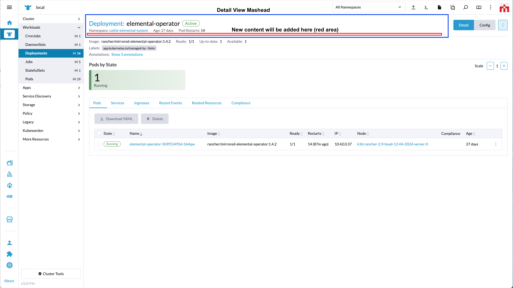
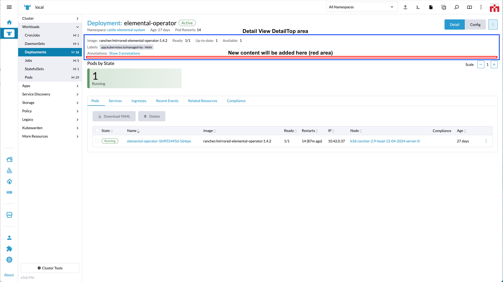
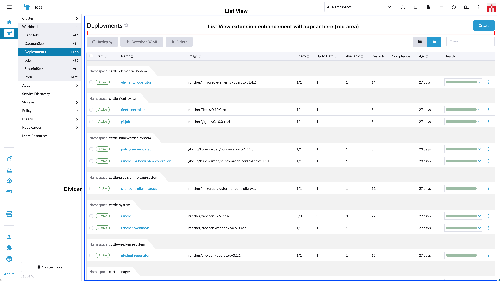

# addPanel

*(Rancher version v2.7.2)*

This method adds a panel/content to the UI.

Method:

```ts
plugin.addPanel(where: String, when: LocationConfig, options: Object);
```

_Arguments_

`where` string parameter admissable values for this method:

| Key | Type | Description |
|---|---|---|
|`PanelLocation.DETAILS_MASTHEAD`| String | Location for a panel on the Details Masthead area of a Resource Detail page |
|`PanelLocation.DETAIL_TOP`| String | Location for a panel on the Detail Top area of a Resource Detail page |
|`PanelLocation.RESOURCE_LIST`| String | Location for a panel on a Resource List View page (above the table area) |

<br/>

`when` Object admissable values:

`LocationConfig` as described above for the [LocationConfig object](../extensions-api#locationconfig-object-definition-when).

<br/>
<br/>

## `'PanelLocation.DETAILS_MASTHEAD'` options



`options` config object. Admissable parameters for the `options` with `'PanelLocation.DETAILS_MASTHEAD'` are:

| Key | Type | Description |
|---|---|---|
|`component`| Function | Component to be rendered as content on the "detail view" Masthead component |

Usage example for `'PanelLocation.DETAILS_MASTHEAD'`:

```ts
plugin.addPanel(
  PanelLocation.DETAILS_MASTHEAD
  { resource: ['catalog.cattle.io.clusterrepo'] },
  { component: () => import('./MastheadDetailsComponent.vue') }
);
```

<br/>
<br/>

## `'PanelLocation.DETAIL_TOP'` options



`options` config object. Admissable parameters for the `options` with `'PanelLocation.DETAIL_TOP'` are:

| Key | Type | Description |
|---|---|---|
|`component`| Function | Component to be rendered as content on the "detail view" detailTop component |

Usage example for `'PanelLocation.DETAIL_TOP'`:

```ts
plugin.addPanel(
  PanelLocation.DETAIL_TOP,
  { resource: ['catalog.cattle.io.clusterrepo'] },
  { component: () => import('./DetailTopComponent.vue') }
);
```

<br/>
<br/>

## `'PanelLocation.RESOURCE_LIST'` options



`options` config object. Admissable parameters for the `options` with `'PanelLocation.RESOURCE_LIST'` are:

| Key | Type | Description |
|---|---|---|
|`component`| Function | Component to be rendered as content above a table on a "list view" |

Usage example for `'PanelLocation.RESOURCE_LIST'`:

```ts
plugin.addPanel(
  PanelLocation.RESOURCE_LIST,
  { resource: ['catalog.cattle.io.app'] },
  { component: () => import('./BannerComponent.vue') }
);
```