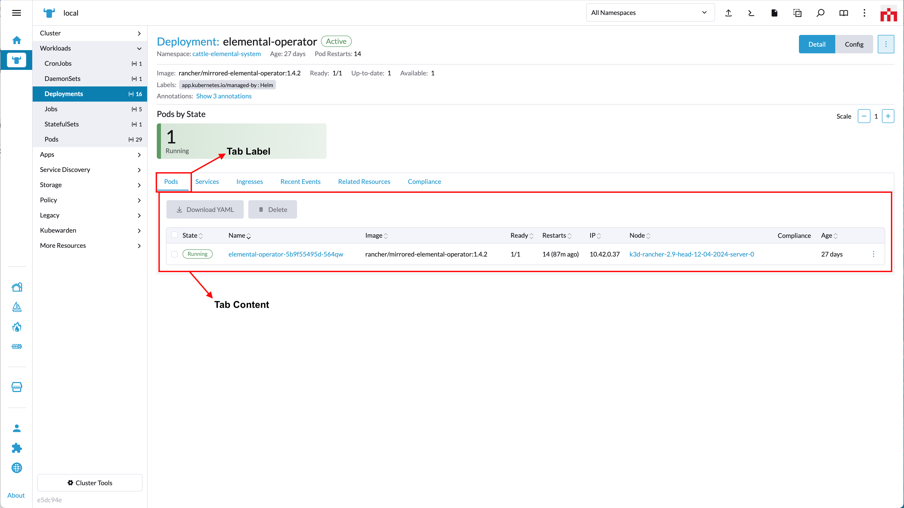

# addTab

*(Rancher version v2.7.2)*

This method adds a tab to the UI.

Method:

```ts
plugin.addTab(where: String, when: LocationConfig, options: Object);
```

_Arguments_

`where` string parameter admissable values for this method:

| Key | Type | Description |
|---|---|---|
|`TabLocation.RESOURCE_DETAIL`| String | Location for a Tab on a Resource Detail page |

<br/>

`when` Object admissable values:

`LocationConfig` as described above for the [LocationConfig object](../extensions-api#locationconfig-object-definition-when).

<br/>
<br/>

## `'TabLocation.RESOURCE_DETAIL'` options



`options` config object. Admissable parameters for the `options` with `'TabLocation.RESOURCE_DETAIL'` are:

| Key | Type | Description |
|---|---|---|
|`name`| String | Query param name used in url when tab is active/clicked |
|`label`| String | Text for the tab label |
|`labelKey`| String | Same as "label" but allows for translation. Will superseed "label" |
|`weight`| Int | Defines the order on which the tab is displayed in relation to other tabs in the component |
|`showHeader`| Boolean | Whether the tab header is displayed or not |
|`tooltip`| String | Tooltip message (on tab header) |
|`component`| Function | Component to be rendered as content on the tab |

Usage example:

```ts
plugin.addTab( 
  TabLocation.RESOURCE_DETAIL,
  { resource: ['pod'] }, 
  {
    name:       'some-name',
    labelKey:   'plugin-examples.tab-label',
    label:      'some-label',
    weight:     -5,
    showHeader: true,
    tooltip:    'this is a tooltip message',
    component:  () => import('./MyTabComponent.vue')
  }
);
```