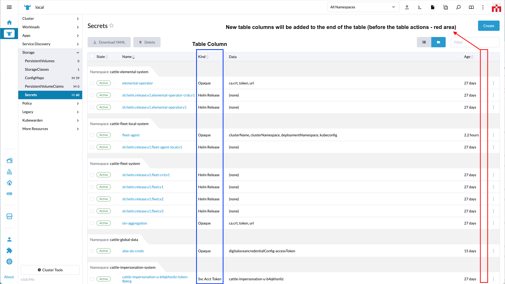

# addTableColumn

*(Rancher version v2.7.2)*

This method adds a table column to a `SortableTable`/`ResourceList` element-based table on the UI.

Method:

```ts
plugin.addTableColumn(where: String, when: LocationConfig, options: Object);
```

_Arguments_

`where` string parameter admissable values for this method:

| Key | Type | Description |
|---|---|---|
|`TableColumnLocation.RESOURCE`| String | Location for a table column on a Resource List View page |

<br/>

`when` Object admissable values:

`LocationConfig` as described above for the [LocationConfig object](../extensions-api#locationconfig-object-definition-when).

<br/>
<br/>

## `'TableColumnLocation.RESOURCE'` options



`options` config object. Admissable parameters for the `options` with `'TableColumnLocation.RESOURCE'` are:

| Key | Type | Description |
|---|---|---|
|`name`| String | Label for column |
|`labelKey`| String | Same as "name" but allows for translation. Will superseed "name" |
|`value`| String | Object property to obtain the value from |
|`getValue`| Fuction | Same as "value", but it can be a function. Will superseed "value" |
|`width`| Int | Column width (in `px`). Optional |
|`sort`| Array | Object properties to be bound to the table sorting. Optional |
|`search`| Array | Object properties to be bound to the table search. Optional |

Usage example for `'TableColumnLocation.RESOURCE'`:

```ts
plugin.addTableColumn(
  TableColumnLocation.RESOURCE,
  { resource: ['configmap'] },
  {
    name:     'some-prop-col',
    labelKey: 'generic.comingSoon',
    getValue: (row: any) => {
      return `${ row.id }-DEMO-COL-STRING-ADDED!`;
    },
    width: 100,
    sort: ['stateSort', 'nameSort'],
    search: ['stateSort', 'nameSort'],
  }
);
```