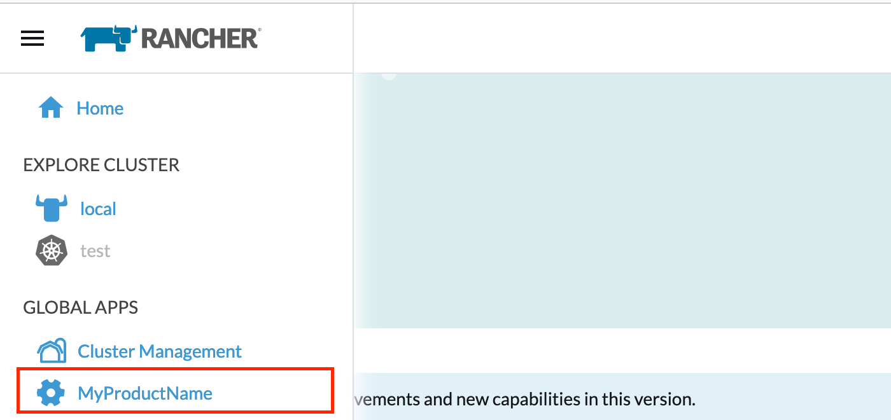
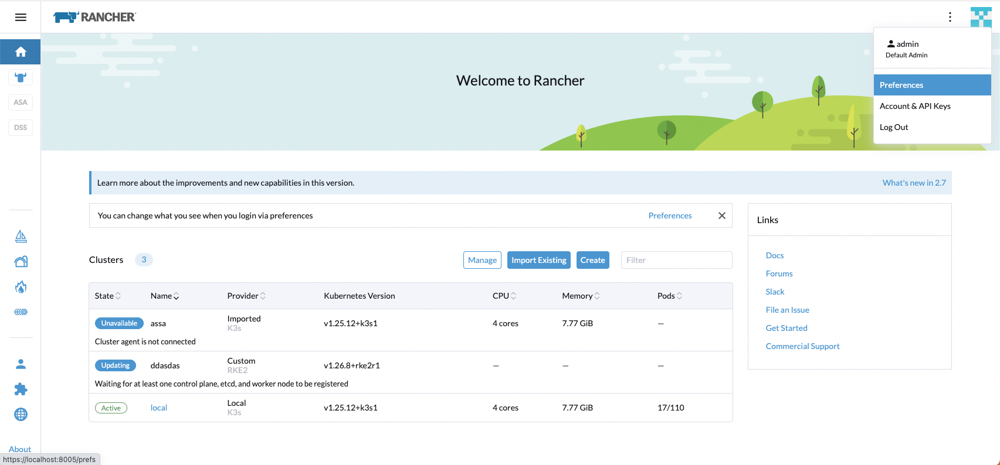
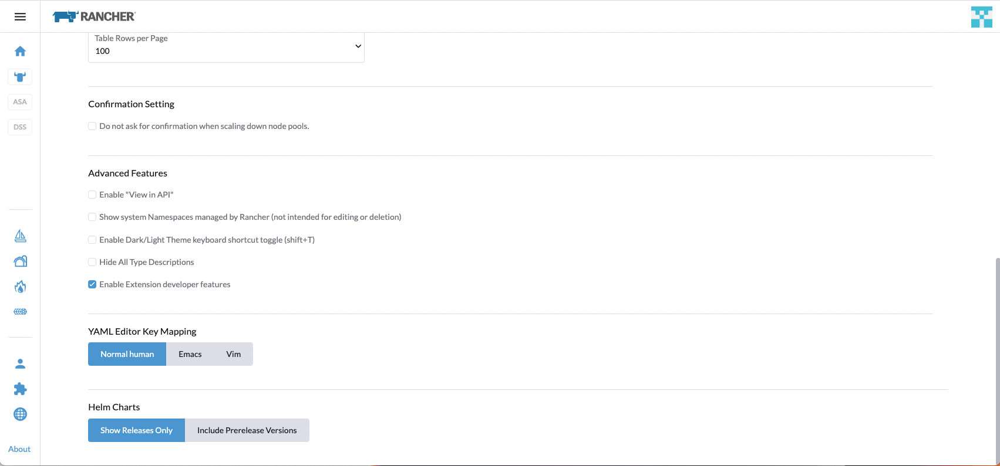
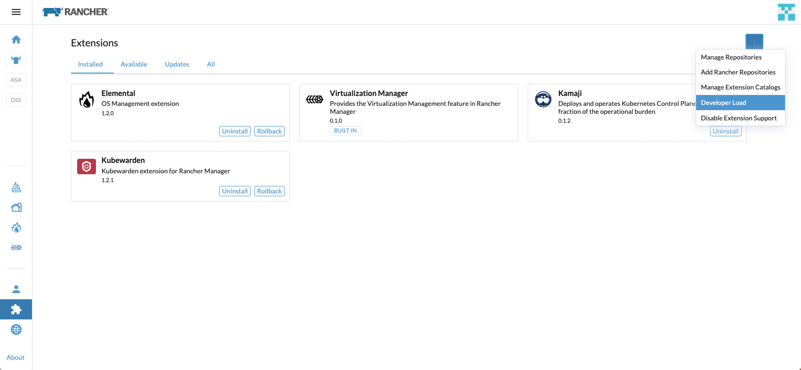
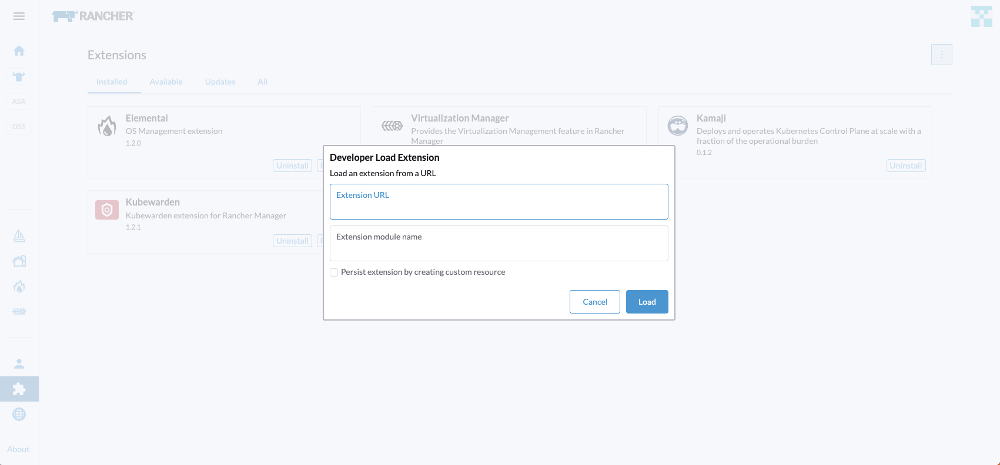
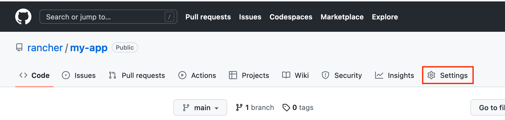
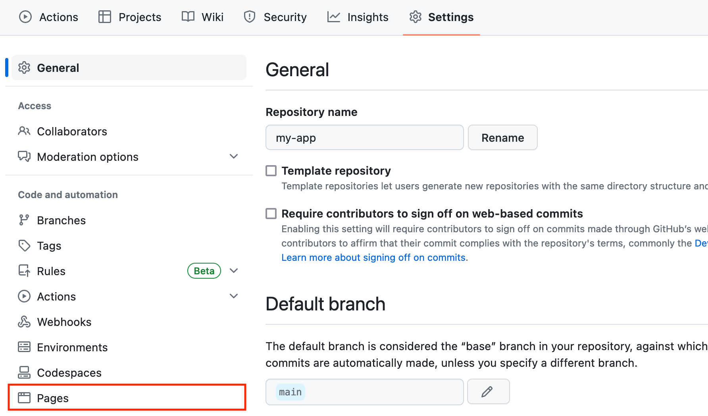
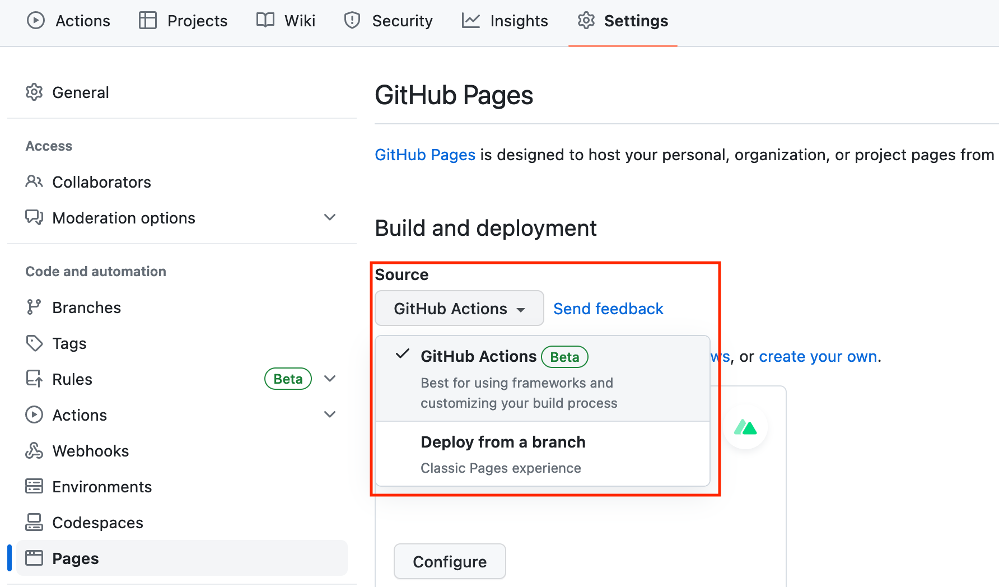

# Getting Started

This guide will walk through creating a new extension from scratch.

## Prerequisites

> Note: Extensions development is only currently supported on Mac and Linux. Windows is not currently supported.

- **Node.js Version:**
  - For **legacy-v1** or **legacy-v2**, you will need Node.js **version `v16`** (tested with `v16.19.1`).
  - For the latest version, you will need Node.js **version `v20`** (tested with `v20.17.0`).
- Yarn package manager installed globally: `npm install -g yarn`.

---

## Creating the Application

To develop a new extension, you need an application UI to host it during development. Rancher provides a helper to create a skeleton application for you. This gives you a full version of the Rancher UI that can be used to develop and test your extension.

Rancher publishes a single npm package, `@rancher/extension`, to help bootstrap the creation of the application and extension. This replaces the previous separate creators (`@rancher/app` and `@rancher/pkg`).

---

### Building Extensions for Different Rancher Versions

When creating extensions, it is important to match the version of the `@rancher/extension` package with the target Rancher version:

- **For Rancher `v2.7` and `v2.8`:** Use the `legacy-v1` tag.
- **For Rancher `v2.9`:** Use the `legacy-v2` tag.
- **For Rancher `v2.10` or later:** Use the latest version of `@rancher/extension`.

---

### Creating an Extension for the Latest Version

To create an extension targeting Rancher `v2.10` or later, run:

```sh
npm init @rancher/extension my-app
cd my-app && yarn install
```

This command will create a new folder `my-app` and populate it with the minimum files needed for your extension.

> Note: The skeleton application references the Rancher dashboard code via the `@rancher/shell` npm module.

### Creating an Extension for Legacy Versions

> Note: The documentation for these legacy versions 

**For Rancher `v2.7` and `v2.8`**

To target these versions, use the `legacy-v1` tag:

```sh
npm init @rancher/extension@legacy-v1 my-app
cd my-app && yarn install
```

**For Rancher `v2.9`:**

To target this version, use the `legacy-v2` tag:

```sh
npm init @rancher/extension@legacy-v2 my-app
cd my-app && yarn install
```

In both cases, ensure you are using Node.js version `v16` during development and testing.

### **_Extension Options_**

There are a few options available to be passed as an argument to the `@rancher/extension` script:

|          Option           | Description                                                                                                                                                                                                                                                                             |
| :-----------------------: | --------------------------------------------------------------------------------------------------------------------------------------------------------------------------------------------------------------------------------------------------------------------------------------- |
|     `--update \| -u`      | This will update all dependencies within the extension to match the declared version of the `@rancher/shell` library based on the tag. See the [Updating Guide](./updating-extensions.md) for usage.                                                                                               |
| `--app-name \| -a <name>` | Allows specifying a different name for the skeleton application instead of using the extension name.                                                                                                                                                                                    |
|  `--skeleton-only \| -s`  | Installs only the skeleton application without creating the extension package.                                                                                                                                                                                                          |
|           `-l`            | This will automatically add the [`.gitlab-ci.yml`](https://github.com/rancher/dashboard/blob/master/creators/extension/app/files/.gitlab-ci.yml) pipeline file for integration with GitLab                                                                                              |
|           `-w`            | Does not add the Github workflow files [`build-extension-catalog.yml`, `build-extension-charts.yml`](https://github.com/rancher/dashboard/tree/master/creators/extension/app/files/.github/workflows) to be used as Github actions. These files will be added automatically by default. |
|           `-t`            | Does not add the template folders automatically into the Extension package. These folders will be added automatically by default                                                                                                                                                        |


### Installing Rancher

See https://ranchermanager.docs.rancher.com/getting-started/installation-and-upgrade. Note: Not all Linux distros and versions are supported. To make sure your OS is compatible with Rancher, see the support maintenance terms for the specific Rancher version that you are using: https://www.suse.com/suse-rancher/support-matrix/all-supported-versions

The above linked installation docs cover two methods confirmed to work with the Dashboard:

- [Single Docker Container](https://ranchermanager.docs.rancher.com/getting-started/installation-and-upgrade/other-installation-methods/rancher-on-a-single-node-with-docker)
- [Kube Cluster (via Helm)](https://ranchermanager.docs.rancher.com/getting-started/installation-and-upgrade/install-upgrade-on-a-kubernetes-cluster)

To use the most recent version of Rancher that is actively in development, use the version tag `v2.10-head` when installing Rancher. For example, the Docker installation command would look like this:

```bash
sudo docker run -d --restart=unless-stopped -p 80:80 -p 443:443 --privileged -e CATTLE_BOOTSTRAP_PASSWORD=OPTIONAL_PASSWORD_HERE rancher/rancher:v2.10-head
```

Dashboard provides convenience methods to start and stop Rancher in a single docker container

```bash
yarn run docker:local:start
yarn run docker:local:stop  // default user password as "password"
```

Note that for Rancher to provision and manage downstream clusters, the Rancher server URL must be accessible from the Internet. If you’re running Rancher in Docker Desktop, the Rancher server URL is `https://localhost`. To make Rancher accessible to downstream clusters for development, you can:

- Use ngrok to test provisioning with a local rancher server
- Install Rancher on a virtual machine in Digital Ocean or Amazon EC2
- Change the Rancher server URL using `<dashboard url>c/local/settings/management.cattle.io.setting`

Also for consideration:

- [K3d](https://k3d.io/v4.4.8/#installation) lets you immediately install a Kubernetes cluster in a Docker container and interact with it with kubectl for development and testing purposes.

You should be able to reach the older Ember UI by navigating to the Rancher API url. This same API Url will be used later when starting up the Dashboard.

### Running the Development Environment

You can run the app with:

```sh
yarn install
API=<Rancher Backend URL> yarn dev
```

You should be able to open a browser at https://127.0.0.1:8005 and you'll get the Rancher Dashboard UI. Your skeleton application is a full Rancher UI - but referenced via `npm`.

## Creating an Extension as a top-level-product

The next step is to create an extension. As a Getting Started example, we'll demonstrate an extension for a [Top-level product](./usecases/top-level-product), but you also have the option to create an extension for a [Cluster-level product](./usecases/cluster-level-product).

### Creating an Extension Package

Rancher provides a helper to add an extension, allowing you to manage multiple extensions or a single extension within the parent folder.

To create a new extension, the command and configuration depend on the Rancher version you are targeting:

- **For Rancher `v2.7` and `v2.8`**, use the `legacy-v1` tag.
- **For Rancher `v2.9`**, use the `legacy-v2` tag.
- **For Rancher `v2.10` or later**, use the latest `@rancher/extension` package.

#### Examples by Rancher Version

1. **For Rancher `v2.7` and `v2.8`:**

```sh
npm init @rancher/extension@legacy-v1 my-app [OPTIONS]
```

2. For Rancher v2.9:

```sh
npm init @rancher/extension@legacy-v2 my-app [OPTIONS]
```

3. For Rancher v2.10 or later:

```sh
npm init @rancher/extension my-app [OPTIONS]
```

> Refer to the [prerequisites](#prerequisites) section at the beginning of this document for the appropriate Node.js version to use based on the Rancher version you are targeting.

#### Matching Tags for Skeleton Applications and Extension Packages

When creating additional extension packages within a skeleton application, the tag of the extension package must match the skeleton application's tag. For example:

- If you create a skeleton application using legacy-v1:

```sh
npm init @rancher/extension@legacy-v1 my-app
```

Any subsequent packages must also use the legacy-v1 tag:

```sh
npm init @rancher/extension@legacy-v1 another-extension
```

- If you create a skeleton application using legacy-v2:

```sh
npm init @rancher/extension@legacy-v2 my-app
```

Any subsequent packages must use the legacy-v2 tag:

```sh
npm init @rancher/extension@legacy-v2 another-extension
```

- For the latest version:

```sh
npm init @rancher/extension my-app
```

Any subsequent packages can simply use the latest version without specifying a tag:

```sh
npm init @rancher/extension another-extension
```

#### Logic Behind the init Script

When you run this command, the init script creates a skeleton application along with an extension package. By default, both the skeleton application and the extension package will have the same name (`my-app` in this case).

- If you want the skeleton application to have a different name than the extension package, you can use the `--app-name` (or `-a`) option:

```sh
npm init @rancher/extension new-extension --app-name my-app
```

This will create a skeleton application named `my-app` and an extension package named `new-extension`.

- If you are already within a skeleton application and want to create another extension package within the same application, simply run the same command:

```sh
npm init @rancher/extension another-extension
```

In this case, only a new extension package (`another-extension`) will be created under the existing skeleton application. No additional skeleton application will be generated.

- If you only want to create the skeleton application without any extension package, you can use the `--skeleton-only` (or `-s`) option:

```sh
npm init @rancher/extension my-app --skeleton-only
```

This will create only the skeleton application, and you can later add extension packages as needed.

This flexibility allows you to structure your development environment based on your specific needs, whether you're starting fresh or adding to an existing setup.

### Compatibility Note

When building multiple extensions, ensure that all packages and the skeleton application share the same tag. The Node.js version required depends on the tag, as outlined in the prerequisites section. Matching tags and Node.js versions is critical to avoid compatibility issues.

### Configuring an Extension

Replace the contents of the file `./pkg/my-app/index.ts` with:

```ts
import { importTypes } from '@rancher/auto-import';
import { IPlugin } from '@shell/core/types';
import extensionRouting from './routing/extension-routing';

// Init the package
export default function (plugin: IPlugin) {
  // Auto-import model, detail, edit from the folders
  importTypes(plugin);

  // Provide extension metadata from package.json
  // it will grab information such as `name` and `description`
  plugin.metadata = require('./package.json');

  // Load a product
  plugin.addProduct(require('./product'));

  // Add Vue Routes
  plugin.addRoutes(extensionRouting);
}
```

Next, create a new file `./pkg/my-app/product.ts` with this content:

```ts
import { IPlugin } from '@shell/core/types';

export function init($plugin: IPlugin, store: any) {
  const YOUR_PRODUCT_NAME = 'myProductName';
  const BLANK_CLUSTER = '_';

  const { product } = $plugin.DSL(store, YOUR_PRODUCT_NAME);

  product({
    icon: 'gear',
    inStore: 'management',
    weight: 100,
    to: {
      name: `${YOUR_PRODUCT_NAME}-c-cluster`,
      path: `/${YOUR_PRODUCT_NAME}/c/:cluster/dashboard`,
      params: {
        product: YOUR_PRODUCT_NAME,
        cluster: BLANK_CLUSTER,
        pkg: YOUR_PRODUCT_NAME,
      },
    },
  });
}
```

And finally create a file + folder `/routing/extension-routing.js` with the content:

```js
// Don't forget to create a VueJS page called index.vue in the /pages folder!!!
import Dashboard from '../pages/index.vue';

const BLANK_CLUSTER = '_';
const YOUR_PRODUCT_NAME = 'myProductName';

const routes = [
  {
    name: `${YOUR_PRODUCT_NAME}-c-cluster`,
    path: `/${YOUR_PRODUCT_NAME}/c/:cluster`,
    component: Dashboard,
    meta: {
      product: YOUR_PRODUCT_NAME,
      cluster: BLANK_CLUSTER,
      pkg: YOUR_PRODUCT_NAME,
    },
  },
];

export default routes;
```

## Running the App

We've created a bare bones extension and exposed a new 'product' that will appear in the top-level slide-in menu. At this stage, it does
nothing other than that!

You should now be able to run the UI again with:

```sh
API=<Rancher Backend URL> yarn dev
```

Open a web browser to https://127.0.0.1:8005 and you'll see a new 'MyProductName' nav item in the top-level slide-in menu.

<div style={{textAlign: 'center'}}>



</div>

> Note: You should be able to make changes to the extension and the UI will hot-reload and update in the browser.

To further develop a product, add new pages and add new types here's an [example](./usecases/top-level-product.md).

## Building the Extension

Up until now, we've run the extension inside of the skeleton application - this is the developer workflow.

To build the extension so we can use it independently, run:

```sh
yarn build-pkg my-app
```

This will build the extension as a Vue library and the built extension will be placed in the `dist-pkg` folder.

## Loading Into Rancher

### Prevent loading your extension in dev mode

When we run `API=<Rancher Backend URL> yarn dev`, our test extension will be automatically loaded into the application - this allows us to develop
the extension with hot-reloading. To test loading the extension dynamically, we can update configuration to tell Rancher not to include our extension.

To do this, edit the file `vue.config.js` in the root `my-app` folder, and add the name of the package you want to exclude, such as:

```js
const config = require('@rancher/shell/vue.config');

module.exports = config(__dirname, {
  excludes: ['my-app'],
});
```

Now restart your app by running the UI again with:

```sh
API=<Rancher Backend URL> yarn dev
```

Open a web browser to https://127.0.0.1:8005 and you'll see that the Example nav item is not present - since the extension was not loaded.

> Note: You need to be an admin user to test Extensions in the Rancher UI

### Test built extension by doing a Developer load

To enable Developer load in the UI, you should go to the user avatar in the top-right and go to `Preferences`. Under `Advanced Features`, check the `Enable Extension developer features` checkbox.





Now we need to serve the built package locally by running the following:

```sh
yarn serve-pkgs
```

This will start a small web server (on port 4500) that serves up the contents of the `dist-pkg` folder. It will output which extensions are being served up - in our case you should see output like that below - it shows the URLs to use for each of the available extensions.

```console
Serving catalog on http://127.0.0.1:4500

Serving packages:

  my-app-0.1.0 available at: http://127.0.0.1:4500/my-app-0.1.0/my-app-0.1.0.umd.min.js
```

Now jump back into the UI and bring in the slide-in menu (click on the hamburger menu in the top-left) and click on 'Extensions'.



Go to the three dot menu and select 'Developer load' - you'll get a dialog allowing you to load the extension into the UI.



In the top input box `Extension URL`, enter:

```
https://127.0.0.1:8005/pkg/my-app-0.1.0/my-app-0.1.0.umd.min.js
```

Press 'Load' and the extension will be loaded, you should see a notification telling you the extension was loaded and if you bring in the side menu again, you should see the Example nav item there now.

This illustrates dynamically loading an extension.

You'll notice that if you reload the Rancher UI, the extension is not persistent and will need to be added again. You can make it persistent by checking the `Persist extension by creating custom resource` checkbox in the Developer Load dialog.

## Creating a Release

Creating a Release for your extension is the official avenue for loading extensions into any Rancher instance. As mentioned in the [Introduction](./introduction.md), the extension can be packaged into a Helm chart and added as a Helm repository to be easily accessible from your Rancher Manager.

We have created [workflows](https://github.com/rancher/dashboard/tree/master/creators/extension/app/files/.github/workflows) for [Github Actions](https://docs.github.com/en/actions) which will automatically build, package, and release your extension as a Helm chart for use within your Github repository, and an [Extension Catalog Image](./advanced/air-gapped-environments) (ECI) which is published into a specified container registry (`ghcr.io` by default). Depending on the use case, you can utilize the Github repository as a [Helm repository](https://helm.sh/docs/topics/chart_repository/) endpoint which we can use to consume the chart in Rancher, or you can import the ECI into the Extension Catalog list and serve the Helm charts locally.

> **WARNING:** When using the provided Github workflows, the base skeleton application name (Found in the root level `package.json`) ___MUST___ be unique when compared with any extension packages found in `./pkg/*`. If an extension package name matches the base skeleton name the workflow will fail due to the "Parse Extension Name" step found in both the ["Build and Release Extension Charts"](https://github.com/rancher/dashboard/blob/422823e2b6868191b9bb33470e99e69ff058b72b/.github/workflows/build-extension-charts.yml#L59-L65) and ["Build and release Extension Catalog Image to registry"](https://github.com/rancher/dashboard/blob/422823e2b6868191b9bb33470e99e69ff058b72b/.github/workflows/build-extension-catalog.yml#L64-L70) workflows.

> Note: GitLab support is offered through leverging the ECI build. For configuration instructions, follow the setps in the [Gitlab Integration](./publishing#gitlab-integration) section.

> Note: If you wish to build and publish the Helm chart or the ECI manually or with specific configurations, you can follow the steps listed in the [Publishing an Extension](./publishing) section.

### Release Prerequisites

In order to have a Helm repository you will need to enable Github Pages on your Github repository. Just follow these steps:

1. Create a branch called `gh-pages` on your Github repository for the extension

2. Go to the repository of the extension and click the `Settings` tab in the top navigation bar.

<div style={{textAlign: 'center'}}>



</div>

3. Then on the left navigation bar of the settings page click the `Pages` tab.

<div style={{textAlign: 'center'}}>



</div>

4. Lastly, select `GitHub Actions` from the `Source` dropdown.

<div style={{textAlign: 'center'}}>



</div>

### Consuming the Helm chart

After releasing the Helm chart you will be able to consume this from the Rancher UI by adding your Helm repository's URL to the App -> Repository list. If you used the automated workflow to release the Helm chart, you can find the URL within your Github repository under the "github-pages" Environment.

The URL should be listed as: `https://<organization>.github.io/<repository>`

Once the URL has been added to the repository list, the extension should appear within the Extensions page.

## Wrap-up

This guide has showed you how to create a skeleton application that helps you develop and test one or more extensions.

We showed how we can develop and test those with hot-reloading in the browser and how we can build our extensions into a package that we can dynamically load into Rancher at runtime. We also went over how to release our extensions as Helm charts using the automated workflow.
