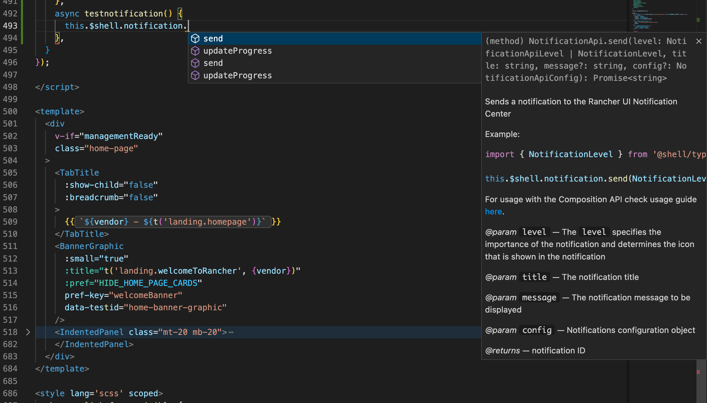

# Frameworks API

## What is the Frameworks API?

The Frameworks API is a functional API that helps extension developers to interact with UI elements that are included in Rancher UI that are important for extension development. We have paid special attention on the implementation side of the architecture behind this API so that developers can use features such as Intellisense and auto-completion in your favourite IDE.



## How to use the Frameworks API

### Using Options API in Vue

To use the Frameworks API in the context of the **Options API** of a Vue component, we globally expose the `$shell` property, which is available under the `this` object, such as:

```
this.$shell.growl.show({ message: 'Hello World!', type: 'success' });
```

### Using Composition API in Vue

To use the Frameworks API in the context of the **Composition API** of a Vue component, we'll need to import the correct method to make the API available in the component:

```
import { useShell } from '@shell/apis';
```

then just assign to a constant in the context for your component and use it, such as:

```
const shellApi = useShell();

// Example method to display a Growl message
const displayGrowlMsg = () => shellApi.growl.show({ message: 'Hello World!', type: 'success' });
```

## Available API's

| API | Description | Example |
| :--- | :--- | :--- |
| [Growl API](./frameworks-api/interfaces/GrowlApi) | Responsible for interacting with growl messages display |  |
| [Slide-In API](./frameworks-api/interfaces/SlideInApi) | Responsible for interacting with slide-in panels |  |
| [Modal API](./frameworks-api/interfaces/ModalApi) | Responsible for interacting with modals |  |
