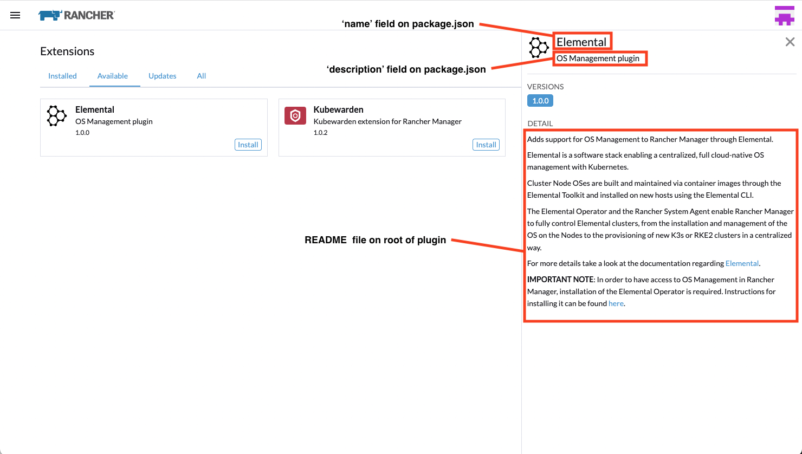

# Initializing Extensions

Follow instructions [here](./extensions-getting-started.md) to scaffold your extension. Once you've done so, there are some initialization steps specific to extensions. Beyond that, extensions largely work the same as the rest of the dashboard. There are a set of top-level folders that can be defined and used as they are in the dashboard: `chart`, `cloud-credential`, `content`, `detail`, `edit`, `list`, `machine-config`, `models`, `promptRemove`, `l10n`, `windowComponents`, `dialog`, and `formatters`. You can read about what each of these folders does [here](../code-base-works/directory-structure.md)

## Defining an Extension information/description

When setting up a extension, on the Extensions part of Rancher Dashboard you will find information regarding the extension:



Which will come from two separate places: the extension initialization and a README file on the root folder of your extension.

The extension initialization should contain the `metadata` extension method to grab fields such as `name` and `description`:

```ts
import { importTypes } from '@rancher/auto-import';
import { IPlugin } from '@shell/core/types';

// Init the package
export default function(plugin: IPlugin) {
  // Auto-import model, detail, edit from the folders
  importTypes(plugin);

  // Provide extension metadata from package.json
  plugin.metadata = require('./package.json');
}
```

And if you add a `README.md` file to your extension root folder, it will populate the `detail` portion of the product description.

## Defining an Extension as a product
Product configuration for extensions is largely unchanged (read more about products [here](../code-base-works/products-and-navigation.md)); however, if the extension contains one product intended to have a standalone UI, some additional product configuration is required, via the `setIsSingleProduct` vuex action.

| Key | Type | Description |
| --- | --- | --- |
| `logoRoute` | [Vue Router route config](https://v3.router.vuejs.org/api/#routes) |  Where to navigate when the upper-left logo is clicked |
| `productNameKey` | String | translation key for product name
| `afterLoginRoute` | [Vue Router route config](https://v3.router.vuejs.org/api/#routes) | where to redirect in auth middleware
| `enableSessionCheck` | Boolean | Toggle verifying the user auth session on [visibility change events](https://developer.mozilla.org/en-US/docs/Web/API/Document/visibilitychange_event). Defaults to `false`
| `getVersionInfo` | Function | Version Info shown in lower left 
| `logo` | SVG | what's on the box: set the logo shown in the top level menu


Defining an extension as product leverages the `addProduct` extension method, which will be defined on the `index.ts` on your root folder:

```ts
import { importTypes } from '@rancher/auto-import';
import { IPlugin } from '@shell/core/types';

// Init the package
export default function(plugin: IPlugin) {
  // Auto-import model, detail, edit from the folders
  importTypes(plugin);

  // Provide extension metadata from package.json
  // it will grab information such as `name` and `description`
  plugin.metadata = require('./package.json');

  // Load a product
  // plugin.addProduct(require('./product'));
}
```

But as for a basic example of a product definition of your extension on your `product.js` file would be something along these lines:

```ts
export function init($plugin, store) {
  const { product } = $plugin.DSL(store, $plugin.name);

  product({
    icon:                  'gear',
    inStore:               'management',
    removable:             false,
    showClusterSwitcher:   false,
  });
}
```

Which will add your extension to the top-level slide-in menu.


## Initializing Extension Stores
Extensions should explicitly register any store modules in their `index.ts` by using the `addDashboardStore` extension method. This will also add familiar [Vuex](https://vuex.vuejs.org/) actions for retrieving and classifying resources, details of which can be found in `shell/plugins/dashboard-store/index`.

An example would be to define in the folder `store` of your extension a basic configuration on an `index.ts` file, such as:

```ts
import { CoreStoreSpecifics, CoreStoreConfig } from '@shell/core/types';
import getters from './getters'; // this would be your getters file on your extension /store folder
import mutations from './mutations'; // this would be your mutations file on your extension /store folder
import actions from './actions'; // this would be your actions file on your extension /store folder

const yourExtensionFactory = (): CoreStoreSpecifics => {
  return {
    state() {
      return { someStateVariable: '' };
    },

    getters: { ...getters },

    mutations: { ...mutations },

    actions: { ...actions },
  };
};
const config: CoreStoreConfig = { namespace: SAME_PRODUCT_NAME_ON_THE_PRODUCT_DEFINITION };

export default {
  specifics: yourExtensionFactory(),
  config
};
```

And on the `index.ts` on your root folder, where you define your extension configuration, you can just use the `addDashboardStore` extension method, such as:

```ts
import extensionStore from './store';

// Init the package
export default function($plugin: IPlugin) {
  // Add Vuex store
  $plugin.addDashboardStore(extensionStore.config.namespace, extensionStore.specifics, extensionStore.config);
}
```


Extensions can optionally define their own cluster store module by setting `isClusterStore` in the store index, eg:
```ts
const config: CoreStoreConfig = {
  namespace:      PRODUCT_NAME,
  isClusterStore: true
};

export default {
  specifics: harvesterFactory(),
  config,
  init:      steveStoreInit
};
```

This will cause the shell `loadCluster` action to run the extension's `loadCluster` action when entering a package, and the extension store's `unsubscribe` and `reset` when leaving. 


## Extension Routing
Extensions should use a pages directory, as the shell currently does, but routing needs to be explicitly defined then added in the extension index using the extension `addRoutes` method. Extension routes can override existing dashboard routes: they'll be loaded on extension entry and unloaded (with old dashboard routes re-loaded...) on extension leave. As touched on above, cluster and product information used to connect to the cluster and define navigation is determined from the route. Consequently, while extensions have a lot of control over their own routing, anything tied into one kubernetes cluster should be nested in `pages/c/_cluster`.

Within the `index.ts` in your root folder, where you define your extension configuration, you can just use the `addRoutes` extension method, such as:

```ts
import extensionRouting from './routing/extension-routing';

// Init the package
export default function($plugin: IPlugin) {
  // Add Vue Routes
  $plugin.addRoutes(extensionRouting);
}
```

As in the `/routing/extension-routing.ts` you would have something like:

```ts
import { YOUR_PRODUCT_NAME } from '../config/elemental-types';
import ExtensionDashboardView from '../pages/extensionDashboardView.vue';

const routes = [
  // this will make the entry point of your extension product the page `extensionDashboardView`
  {
    name:      `${ YOUR_PRODUCT_NAME }-c-cluster`,
    path:      `/:product/c/:cluster/dashboard`,
    component: ExtensionDashboardView,
  }
];

export default routes;
```

The routing definition on this example in `/routing/extension-routing.ts` is based on Vue Router. Check the official documentation [here](https://router.vuejs.org/guide/).


## Navigation In and Out of Extensions
Extensions can define `onEnter` and `onLeave` hooks in their index `addNavHooks` extension method, which will run when the authenticated middleware detects a package change by checking the route meta property. `onEnter` and `onLeave` accept the same props: the vuex store context and a config object containing: 

| Key | Type | Description |
|---|---|---|
|`clusterId`| String | The unique ID of the current cluster, determined by the route's `cluster` param |
|`product`| String | The name of the product being navigated to, also taken from the route |
|`oldProduct`| String | The name of the product being navigated away from |
|`oldIsExt`| Boolean | True if the previous product was in a package (note that this doesn't distinguish between inter- and intra-package product changes) |

The `authenticated` middleware will:
* Connect to the management cluster (`loadManagement`)
* Apply product config, as determined from the route (`applyProducts`)
* If an old extension is loaded, run its `onLeave` hook
* Run `onEnter` hook for new extension 
* Run `loadCluster` (which, as stated above, can run load and unload cluster actions defined in extensions)

An example of the usage `onEnter` and `onLeave` using the `addNavHooks` extension method would be:

```ts
import { importTypes } from '@rancher/auto-import';
import { IPlugin, OnNavToPackage, OnNavAwayFromPackage } from '@shell/core/types';

const onEnter: OnNavToPackage = async(store, config) => {
  // define any function needed here for `onEnter`
};
const onLeave: OnNavAwayFromPackage = async(store, config) => {
  // define any function needed here for `onLeave`
};

// Init the extension
export default function(plugin: IPlugin) {
  // Add hooks to Vue navigation world
  plugin.addNavHooks(onEnter, onLeave);
}
```