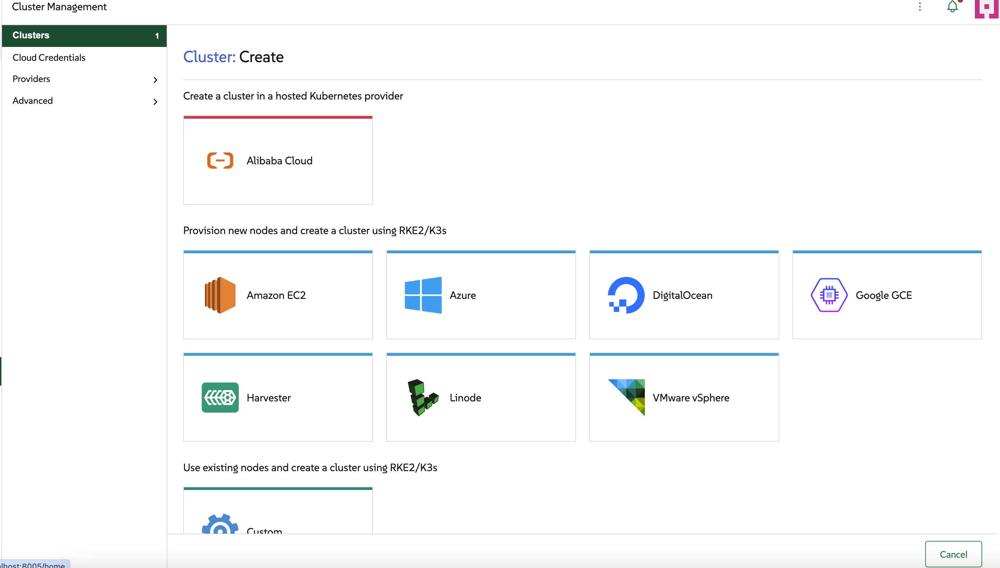

# Localization

The display name for your provider is handled automatically by Rancher's localization system.

1.  In your `provisioner.ts`, ensure the `id` property is set to your provider's unique identifier (e.g., `ali`).

2.  Create a translation file `l10n/en-us.yaml` in your extension package.

3.  Add a key `cluster.provider.<your-provider-id>` with the desired display name. This is the key Rancher checks for when displaying providers cards inside the cluster creation wizard.

For the `ali` provider, the `l10n/en-us.yaml` file would contain:

```yaml
cluster:
  provider:
    ali: Alibaba Cloud
```

Rancher will then automatically display "Alibaba Cloud" in the cluster creation wizard.



Read more about translations [here](../advanced/localization)