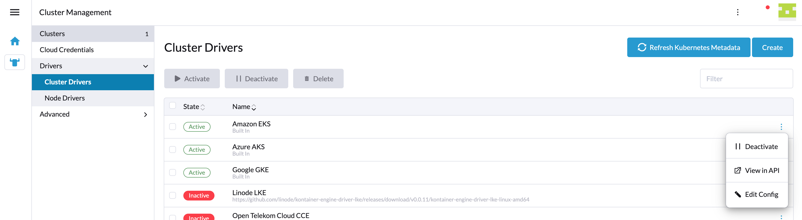
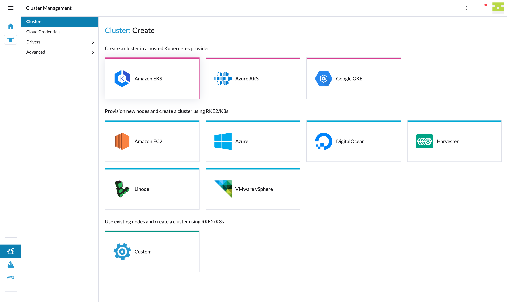

# Cluster Provisioning

The UI provides a number of ways to customize the processes of creating, importing, and editing clusters. This includes
- Adding additional Cluster Provisioner types
- Customizing or replacing components used in the create process
- Adding tabs
- Adding Hooks to the processes that persist cluster resources
- Performing overrides that replace the process to persist cluster resources

## Custom Cluster Provisioner
New cluster provisioners can be added that can tailor the create/edit experience for their own needs.

### Provisioner Class
To customize the process of creating or editing these resources the extension should register a provisioner class which implements the `IClusterProvisioner` interface.

```
  plugin.register('provisioner', 'my-provisioner', ExampleProvisioner);
```

> Note that `register` allows us to register an arbitrary extension and we introduce the type `provisioner`.

Below is outline for the functionality the class provides, for detail about the `IClusterProvisioner` interface see the inline documentation.

The class provides a way to...
1. show a card for the new cluster type for the user to choose when selecting a provider
1. handle custom machine configs that haven't necessarily been provided by the usual node driver way
1. hooks to extend/override the cluster save process. Either..
    - Override all of the cluster save process
    - Extend/Override parts of the cluster save process. This allows a lot of the boilerplate code to manage addons, member bindings, etc to run
      - run code before the cluster resource is saved
      - replace the code that saves the core cluster
      - run code after the cluster resource is saved
1. show a custom label for the provider of the custom cluster
    - This is done by setting the `ui.rancher/provider` annotation in the cluster
    - It's used in the UI whenever showing the cluster's provider
1. show custom tabs on the Detail page of the custom cluster

To make API calls from the UI to a different domain, Rancher includes a [proxy](https://github.com/rancher/rancher/blob/release/v2.6/pkg/httpproxy/proxy.go) that can be used to make requests to third-party domains (like a cloud provider's API) without requiring that the other end supports CORS or other browser shenanigans.  Send requests to `/meta/proxy/example.com/whatever/path/you/want` and the request will be made from the Rancher server and proxied back to you.

TLS and port 443 are assumed.  Add a port after the hostname to change the port (`example.com:1234`).  For plain HTTP, first stop and consider the chain of life decisions which have led you to this point. Then if you still think you need that, use `/meta/proxy/http:/example.com:1234` (note one slash after `http:`, not two).  The hostname must be included in the whitelist defined in global settings, or in the configuration for an active node driver.  If if isn't your request will be denied.  (This prevents a malicious (non-admin) user from abusing the Rancher server as an arbitrary HTTP proxy or reach internal IPs/names that the server can reach directly but the user can't from the outside.)

The rest of the path and query string are sent to the target host as you'd expect.

Normal headers are copied from your request and sent to the target.  There are some exceptions for sensitive fields like the user's rancher cookies or saved basic auth creds which will not be copied.  If you send an `X-Api-Cookie-Header`, its value will be sent as the normal `Cookie` to the target.  If you send `X-API-Auth-Header`, that will be sent out as the normal `Authorization`.

But normally you want to make a request using a Cloud Credential as the authorization, without knowing what the secret values in that credential are.  You ask for this by sending an `X-Api-CattleAuth-Header` header.  The value of the header specifies what credential Id to use, and a [signer](https://github.com/rancher/rancher/blob/release/v2.6/pkg/httpproxy/sign.go) which describes how that credential should be injected into the request.  Common options include `awsv4` (Amazon's complicated HMAC signatures), `bearer`, `basic`, and `digest`.  For example if you send `X-Api-CattleAuth-Header: Basic credId=someCredentialId usernameField=user passwordField=pass`, Rancher will retrieve the credential with id `someCredentialId`, read the values of the `user` and `pass` fields from it and add the header `Authorization: Basic <base64(user + ":" + pass)>` to the proxied request for you.

## Custom Components and Models
Rancher provides mechanisms to overwrite or create new components. You can learn how to create custom [cloud credential](./cloud-credential.md) or [machine configuration](./node-driver/machine-config.md) components in this documentation.

### Resources
Creating a cluster revolves around the provisioning and management cluster resources. All node driver based clusters are provisioned using `provisioning.cattle.io.cluster` object, while all kontainer driver and hosted provider based clusters currently need to be provisioned using `management.cattle.io.cluster` object. Both types of cluster will load as a `provisioning.cattle.io.cluster` resource, but additional steps will be required for the ones using `management.cattle.io.cluster`.

### Provisioning Cluster
The `provisioning.cattle.io.cluster` contains all the details of the cluster, aside from the machine configuration.
In the UI it is an instance of the [`provisioning.cattle.io.cluster.js`](https://github.com/rancher/dashboard/tree/master/shell/models/provisioning.cattle.io.cluster.js) class, which has lots of great helper functions, most importantly `save`, which extensions are able to extend and overwrite in their models.
When provisioning or editing a cluster, `provisioning.cattle.io.cluster` resource will be available as `this.value`.

For a RKE2/node driver cluster, the machine configuration is also required:
  - The machine configuration defines how the individual nodes within a node pool will be provisioned. For instance which region and size they may be
  - These normally have an type of `rke-machine-config.cattle.io.<provider name>config`, which matches the id of it's schema object

### Management Cluster
There is one `management.cattle.io.cluster` cluster resource for every downstream cluster managed by Rancher.
Currently, it is used to create or modify all hosted and imported clusters. To access it, you can do
```ts
//On creation
 this.normanCluster = await store.dispatch('rancher/create', { type: NORMAN.CLUSTER, ...defaultCluster }, { root: true });

//On edit
const liveNormanCluster = await this.value.findNormanCluster();
this.normanCluster = await store.dispatch(`rancher/clone`, { resource: liveNormanCluster });
```
and all changes should be done to it, instead of the `this.value`, which refers to the `provisioning.cattle.io.cluster` object, since the provisioning cluster will not have all the available information. This is a drawback of the current Rancher architecture.
Once all the changes are made, instead of saving `this.value` resource, save needs to be called on the normanCluster, which represents `management.cattle.io.cluster`.
```ts
this.normanCluster.save();
```

You can see a more detailed example of it [here](./hosted-provider/cluster.md).

### Models
In addition to adding [new models](../folder-structure#models), extensions allow extending existing model by using [IClusterModelExtension](https://github.com/rancher/dashboard/tree/master/shell/core/types-provisioning.ts):
```ts
// You do not have to specify all these getters and you can refer to the file linked above for more information on each getter
export class NewModelExtension implements IClusterModelExtension {
  constructor(private context: ModelExtensionContext) {}

  useFor(cluster: ICluster) {
    return cluster?.metadata?.annotations['ui.rancher/provider']  === new_provider;
  }

  // Specify which tabs you want to show for this resource
  get detailTabs(): any {
    return {
      machines:     false,
      logs:         false,
      registration: false,
      snapshots:    false,
      related:      true,
      events:       false,
      conditions:   false,
    };
  }

  // Specify how you want your machine provider to be displayed
  machineProviderDisplay(): string {
    return 'New provider';
  }
  // Specify how you want your provisioner to be displayed
  provisionerDisplay(cluster: ICluster): string {
    return 'New provisioner'
  }

  // Specify parent cluster
  parentCluster(cluster: ICluster): string {
    return cluster.metadata?.annotations?.['ui.rancher/parent-cluster-display'];
  }
  // You can modify existing actions here or provide a new list
  availableActions?(cluster: any, actions: any[]): any[] | undefined{
    return [];
  }
}
```

### Components
When creating or editing a cluster the user can see the cloud credential and machine pool components.

These can be provided as per the `Custom Components` section.

```
  plugin.register('cloud-credential', 'my-provisioner', false);
  plugin.register('machine-config', 'my-provisioner', () => import('./src/test.vue'));
```

> This example registers that no cloud credential is needed and registers a custom component to be used for Machine Configuration within a node/machine pool - this is the same as with Node Drivers - e.g. with the OpenStack node driver example.

### Custom tabs in the Cluster's Cluster Configuration 

Check the documentation about adding a tab to the Cluster Configuration area in the interface for cluster creation **[here](../api/tabs.md#tablocationcluster_create_rke2-options)**.

### Custom tabs in the Cluster's detail page

When clicking on a created cluster in the UI the user is shown details for the cluster. This page has some tabs which may not be applicable to the custom provider. The provider class has a way to hide these. To add a new custom tab the following can be used

```
  plugin.addTab(TabLocation.RESOURCE_DETAIL_PAGE, {
    resource:     ['provisioning.cattle.io.cluster'],
    context:   { provider: ExampleProvisioner.ID }
  }, {
    name:      'custom',
    label:     'Custom Tab',
    component: () => import('./src/example-tab.vue')
  });
```

Note we use the new `context` property to allow us to target the tab only when the cluster is of our provider type.


### Hiding custom Provisioner card on driver deactivation

On `Cluster Management`, `Providers`, `Cluster Drivers` an administrator/user (depending on permissions) can deactivate your custom cluster driver. 



If that happens, then by default your custom Provisioner card will still appear on the Rancher UI



In order to hide it when the custom Provisioner is deactivated, you will need to add the following property to the [Provisioner Class](#provisioner-class) created before:

```
import { MANAGEMENT } from '@shell/config/types';

.....
export class ExampleProvisioner implements IClusterProvisioner {
  ....

  get hidden(): boolean {
    const kontainerDriver = this.context.getters['management/byId'](MANAGEMENT.KONTAINER_DRIVER, 'my-provisioner');

    return !kontainerDriver?.spec?.active;
  }
}
```

### Hiding Hosted provider card
In `Cluster Management`, `Providers`, `Hosted Providers` an administrator/user (depending on permissions) can deactivate your hosted provider. This will update 'kev2-operators' setting with 'active' set to false for that provider and corresponding card will not appear inside cluster creation and import wizards.

### Localization

The custom cluster type's label is defined as per any other extension text in `l10n/en-us.yaml` as `cluster.provider.<provider name>`.