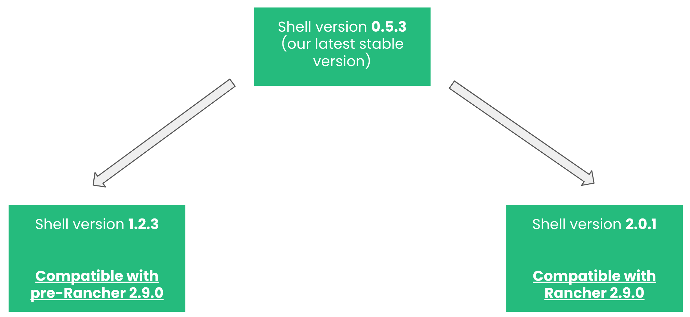

# Rancher 2.9 update

## What happened

With the release of Rancher 2.9 some breaking changes were introduced to improve performance on how Rancher Dashboard deals with k8s resources in order to present it's views to the users (create, edit, detail, list views).  
With that in mind, we have made some important changes to the Shell package (our core JS package) which needed to be updated so that extensions would work with this release of Rancher.


## What changed in Shell

At the time of writing this documentation, the latest stable Shell version was `0.5.3`. We've now updated the Shell versioning system in the following way:



Effectively, we've had to split Shell into two different versions:

- `1.2.3` - which is compliant with any **pre-2.9** Rancher system (effectively should be the same as using `0.5.3`).

- `2.0.0` - which is compliant and **needed** for a **2.9** Rancher system


In a nutshell, for future releases of your extension to **work on Rancher 2.9** you will need to do another version of your extension using Shell `2.0.0`.

> If your extension is using Shell `0.5.3` and you **don't need** to be compliant with Rancher 2.9, there's no update to do.

The decision to update the versions this way was to ensure that from this point forward we will have the most accurate versioning to present to developers.  
Only Major version updates are expected to contain breaking changes. Minor and Patch should not include any breaking changes moving forward.

## How to update your extension for Rancher 2.9

- Test locally your extension with the new Shell version `2.0.0`. Also do a local build and Developer Load on the desired Rancher system to make sure everything works as expected. Check documentation about a Developer Load [here](./extensions-getting-started#test-built-extension-by-doing-a-developer-load).

- Before publishing it, add annotation(s) to your extension `pkg/<-YOUR EXTENSION->/package.json` like:

```
{
  "name": "your-extension",
  "description": "your-extension description",
  "version": "1.2.1",
  "rancher": {
    "annotations": {
      "catalog.cattle.io/rancher-version": ">= 2.9.0",
      "catalog.cattle.io/ui-extensions-version": ">= 2.0.0"
    }
  },
  ....
}
```

> With these annotations your extension will be "locked" to Rancher version greater than `2.9.0` and will also be "locked" to a UI Extensions version (Shell version) greater than or equal to `2.0.0`.  
These are not mandatory but rather a good practice so that your future extension versions are correctly bound to the different systems/versions.  
For more information about the annotation we allow for, check the documentation [here](./extensions-configuration#configurable-annotations).

- After the above steps, just publish a new version of the extension with Shell `2.0.0`. That published version should now be compliant with Rancher 2.9.


To find out more about the support matrix for Shell versions in regards to Rancher versions, check the support matrix [here](./support-matrix#shell-support-matrix).