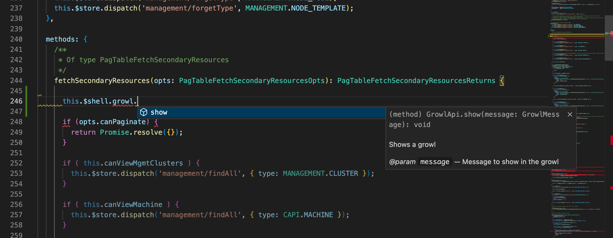

# Shell API

> Available from Rancher `2.14` and onwards

## What is the Shell API?

The Shell API is a functional API that helps extension developers to interact with UI elements that are included in Rancher UI that are important for extension development. We have paid special attention on the implementation side of the architecture behind this API so that developers can use features such as Intellisense and auto-completion in your favourite IDE.



## How to use the Shell API

### Using Options API in Vue

To use the Shell API in the context of the **Options API** of a Vue component, we globally expose the `$shell` property, which is available under the `this` object, such as:

```ts
import { NotificationLevel } from '@shell/types/notifications';

this.$shell.notification.send(NotificationLevel.Success, 'Some notification title', 'Hello world! Success!', {})
```

### Using Composition API in Vue

To use the Shell API in the context of the **Composition API** of a Vue component, we'll need to import the correct method to make the API available in the component:

```ts
import { useShell } from '@shell/apis';
```

then just assign to a constant in the context for your component and use it, such as:

```ts
import { NotificationLevel } from '@shell/types/notifications';

const shellApi = useShell();

// Example method to display a Growl message
const sendNotification = () => shellApi.notification.send(NotificationLevel.Success, 'Some notification title', 'Hello world! Success!', {})
```

## Available API's

| API | Description | Example |
| :--- | :--- | :--- |
| [Slide-In API](./shell-api/interfaces/SlideInApi) | Responsible for interacting with Slide-In panels |  |
| [Modal API](./shell-api/interfaces/ModalApi) | Responsible for interacting with modals |  |
| [Notification API](./shell-api/interfaces/NotificationApi) | Responsible for interacting with the Rancher UI Notification Center |  |
| [System API](./shell-api/interfaces/SystemApi) | API for system related information |  |
