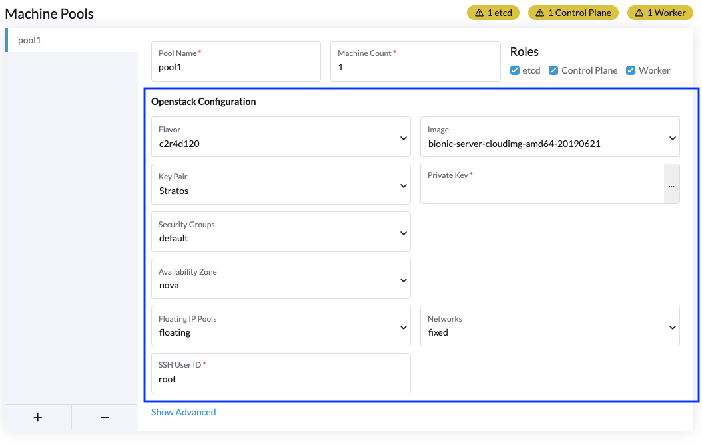

# Machine Config

Similar to the Cloud Credential component, the Machine Config component should display the controls for the fields of the node driver that are relevant to the configuration of the machine to be created.  The machine pool name, saving, etc is handled outside of the component. You can use `fetch()` to load data from the provider's API (e.g. list of regions or instance types) as needed.

A machine config component for a given driver will be automatically registered when placed in the `machine-config` folder and named with the name of the driver (e.g. `openstack.vue`).

> Note: Your extension's entry file must call `importTypes` for the automatic registration to work

The selected cloud credential ID is available as a `credentialId` prop.  You will always know that ID, and can use it to make API calls, but **should not** rely on being able to actually retrieve the cloud credential model corresponding to it.  Users with lesser permissions may be able to edit a cluster, but not have permission to see the credential being used to manage it.

Your component can emit a `validationChanged` event every time a value changes to report validation status of the machine configuration.

The `value` property of the component will be bound to the machine configuration resource. The fields available on that resource are determined by the corresponding node driver.

Other properties:

- `busy` - Boolean to indicate if the controls should be disabled while the UI is busy (typically during a save operation)
- `mode` - String mode - can be `view`, `edit` or `create`. Controls should be disabled when in view mode. Controls should be populated from existing values for the view and edit modes.

Example Machine Config UI:

> Note: The UI provided by the custom component is shown in the blue box. The full Machine Pool Ui is shown to give context.
