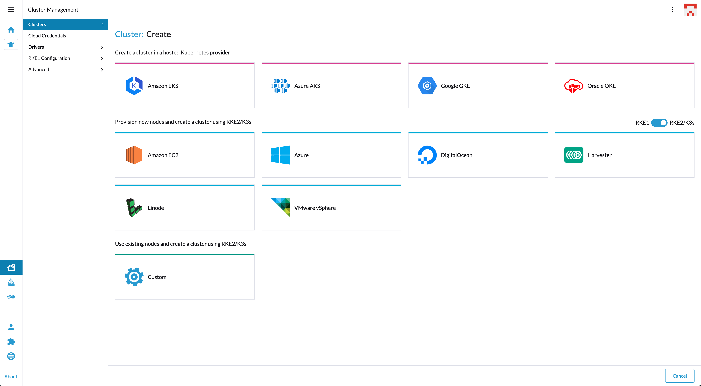

# Setting the node driver icon

While in the Cluster Provisioning screen in Rancher UI, you've noticed that node drivers have icons for each provider:



In order to set the icon for your custom node driver in the cluster provisioning screen, you can use the following method:

```
plugin.register('image', 'providers/YOUR_PROVIDER_NAME.svg', require('./PATH_TO_YOUR_ICON/YOUR_ICON_NAME.svg'));
```

> **Note:** This feature should only be compatible with Shell version `2.0.1` (for compatibility with Rancher check our [Shell support matrix](../../support-matrix.md))