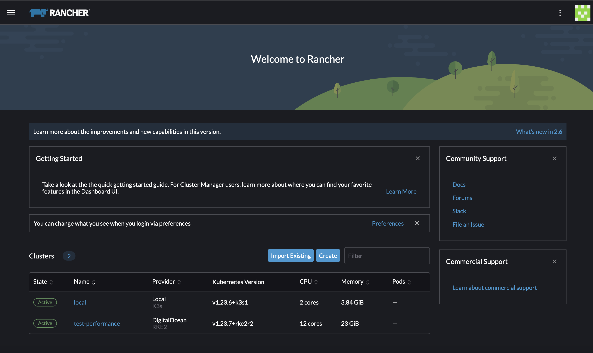

# UI Walkthrough

This page is intended to answer the question "What am I looking at?" for new Rancher UI developers who are navigating Rancher.

This is not an exhaustive guide to Rancher. For more details, see the docs https://ranchermanager.docs.rancher.com/v2.8 or the other pages of these developer docs.

## 1. Home Page

Rancher is basically a command-and-control center for centralizing management of Kubernetes clusters. After logging in, the first thing you see is the Home page, which gives you a brief summary of the clusters managed by Rancher and their status:

## 2. Navigation

There are two main areas of Rancher: Cluster Management and Cluster Explorer.

### 2.1 Cluster Management

Cluster Management is intended primarily to be used by admins. It is the command-and-control center for someone who wishes to manage many Kubernetes clusters, such as by configuring an external authentication provider that will allow someone's GitHub or Amazon credentials to give users access to multiple clusters managed by Rancher. This is also the area where you can perform Kubernetes admin operations such as upgrading Kubernetes itself.

To get to Cluster Management, go to the upper left corner and click **≡ > Cluster Management.** The main page is a list of all the downstream clusters managed by Rancher, plus the special `local` cluster that Rancher itself is installed on.

The `local` cluster is where all the data for managing downstream clusters is stored. It contains all the data for Rancher at a global (multi-cluster) scope, such as permission definitions and a spec for the desired state of all downstream clusters.

Note that the list of clusters in Cluster Management leads to two different cluster detail views. The first is accessed by clicking the name of the cluster in the list of clusters. This detail page contains information about the cluster that is outside the scope of Kubernetes itself, but still of interest to an admin. For example, it contains a list of machines with shortcuts to let you SSH into each of them, and the **Snapshots** tab gives you a list of snapshots that an admin can use to restore the Kubernetes cluster from backup:

The other cluster detail page is Cluster Explorer, explained below.

### 2.2 Cluster Explorer

The other cluster detail view is reached by clicking the **Explore** button in the list of clusters in Cluster Management. This leads to what we call Cluster Explorer, and it is the other main area of the core Rancher product:

Unlike Cluster Management, Cluster Explorer is primarily intended to be used by standard Kubernetes users, or users who are interested in installing applications on an individual cluster.

The scope of what you can manage with Cluster Explorer is the same as the scope of what you can manage with the `kubectl` command line tool for upstream Kubernetes. Cluster Explorer provides forms that make it easier to create, edit and delete the same Kubernetes resources that you can manage with `kubectl`. You can deploy and expose applications with `kubectl` or with forms in Cluster Explorer, whichever is easier.

Similar to how `kubectl` works, your view in Cluster Explorer can be filtered by namespaces. When you list resources in `kubectl`, the results are limited to a (configurable) default namespace if not otherwise specified.

Through the top nav, Cluster Explorer also directly gives you `kubectl` command line access for convenience:

In addition to letting you filter Kubernetes resources by namespace, the top nav of Cluster Explorer also lets you filter by project:

So if you are ever looking for something in Cluster Explorer and you don't see it, you may need to change the namespace filtering in the top nav.

A project is a group of namespaces. Projects are a Rancher-created feature that did not have an equivalent in upstream Kubernetes at the time Rancher introduced them. Newer Kubernetes versions have a feature called "hierarchical namespaces" which provide the same concept of a group of namespaces, and projects may be re-implemented to take advantage of hierarchical namespaces in a later Rancher version.

The purpose of a project is mainly to make it easier for admins to give users permission to access an entire group of namespaces at once. They are also used for multi-tenancy clusters, in which admins want to fence off a group of namespaces for users who will never have access to the entire cluster. Sometimes they are used for organizational purposes.

## 3. Cluster Provisioning

One of the core features of Rancher is cluster provisioning. Rancher offers a lot of flexibility in how you can install or set up a Kubernetes cluster through the Rancher UI. There are more details in the documentation (https://ranchermanager.docs.rancher.com/v2.8/pages-for-subheaders/kubernetes-clusters-in-rancher-setup) which are too complicated to explain here, because there are many types of clusters that Rancher can manage, and Rancher can manage clusters that integrate with different technology stacks.

In a typical use case, Rancher will take your credentials for a cloud infrastructure provider, such as AWS EC2 or Digital Ocean, and it will integrate with the API of that cloud infrastructure provider. Rancher can add new Linux servers in the cloud for you, and the cost of the resources that it provisions will be billed to the user's account associated with the cloud credentials that Rancher is using. Then Rancher installs Kubernetes on those nodes and provide a UI to add users to the cluster through Rancher, or deploy applications on the cluster, along with any other operation supported by upstream Kubernetes.

Usually, the first step to cluster provisioning is to get cloud credentials and give them to Rancher. Cloud credentials are listed in Cluster Management:

Rancher lets you create numerous different types of cloud credentials. These choices allow companies a large amount of flexibility, while providing a unified UI to manage clusters consistently:

Using those credentials, Rancher can then set up Kubernetes clusters using the cloud provider that corresponds to their cloud credentials. There are also multiple options for the Kubernetes distribution that is used (RKE1, K3s or RKE2):

The below screenshot shows an example of creating an RKE2 cluster in Digital Ocean. Note that an existing cloud credential for Digital Ocean is selected at the top:

## 4. Kubernetes Configuration

From the list of clusters in Cluster Management, the context menu in each row exposes forms that let you configure any Kubernetes option from basic to advanced:

Note that if you try to go to Edit Config for the special `local` cluster that runs Rancher itself, the edit form is heavily restricted for security reasons:

Whereas for downstream Kubernetes clusters, many more options are exposed:

When editing a Rancher-provisioned downstream RKE2 cluster, you can edit who can access the cluster, the CPU/memory and disk size of the nodes in the cluster, and all other options:

For documentation on these options, you would refer to the docs that correspond to the Kubernetes distribution you are using. For example, since an RKE2 cluster is being provisioned in this example, you would refer to the RKE2 documentation as the ultimate source of truth for information about those options: https://docs.rke2.io/

## 5. Users, Permissions and Authentication

Rancher's **Users & Authentication** section allows admins to manage all Rancher users who access to any of the clusters managed by Rancher:

However, you can't assign someone to a cluster directly from the user list or detail views. To give a user access to a cluster, you have to navigate to a downstream cluster. You can add them from Edit Config for a cluster from the Cluster Management area, or you can add them from Cluster Explorer under **Cluster > Cluster Members** in the side nav.

Rancher integrates with multiple authentication providers, and provides forms to let you configure several auth providers from within Rancher:

It is considered a best practice to use a third-party auth provider to keep track of the identity of Rancher users.

## 5. Helm Chart Applications

Helm is Rancher's preferred tool for installing applications on Kubernetes. Cluster Explorer has a section designed to make it easier to install Helm chart apps by providing a catalog of apps to choose from:

If you click an app in the catalog, you can then directly install the Helm chart app through Cluster Explorer. This example shows what it looks like to install the monitoring application:

After installing a Helm chart app, you will then see all the Kubernetes resources installed by that app show up in Cluster Explorer. For example, after installing the monitoring app, if you go to Deployments in Cluster Explorer, you will see the Deployments that the monitoring Helm chart app has installed. 

It is not recommended to manually edit resources that are managed by a Helm chart; it is better to upgrade to a new version of the chart instead, because that will update the desired state of the app's resources for you. If you manually edit a resource managed by a Helm chart app, the change could be reverted the next time the Helm chart app is edited or upgraded.

Some official Rancher apps extend the functionality of Cluster Explorer when installed. For example, when the monitoring application is installed, a new **Monitoring** nav item is added to the side nav:

You can uninstall Helm chart apps by selecting the charts installed by the app and deleting them:

Many users extend the catalog of apps to choose from by adding Git repositories in Cluster Explorer:

After you add a Git repository, Rancher searches the repo for Helm chart apps and adds them to the catalog of available apps to install, which are available under **Charts** in the side nav. From there, you can install and upgrade the apps on your cluster through Cluster Explorer.

## 6. Rancher Plugins

If you click the top left corner of Rancher, you get a menu that includes some plugins. "Plugins" is a term we use to describe a project that is developed separately from Rancher. But although the project is maintained in a separate GitHub repository, it can also extend and enhance the Rancher UI.

The **Continuous Delivery** part of Rancher is a user interface for Fleet, a separate project that you can use even if you don't use Rancher. Fleet lets you define the desired state of up to a million clusters, and Rancher uses it under the hood to define the desired state of Rancher managed clusters. The docs on the Fleet project are here: https://fleet.rancher.io/ Fleet is not for basic use cases; it is intended to be used primarily by users managing large numbers of identical Kubernetes clusters.

The **Virtualization Management** section is also a plugin. The source for that functionality is the Harvester project, which lets you manage Linux servers that may be on-premises. The docs for the Harvester project are here: https://docs.harvesterhci.io/v1.0/

## 7. Node Templates

You may notice that in Cluster Management, there is a section for RKE1 node templates. Node templates provide a way to capture details of machines, such as CPU, memory, and disk size. In V1 cluster provisioning, you must select a node template for each node pool in the RKE1 cluster.

Node templates make it more convenient to define node pools so that you don't have to fill in details of machine configuration repetitively. Admins can assign users permission to see them, and it can be convenient to give someone access to a node template without giving them access to the underlying cloud credentials, which could give them access to more cloud resources than necessary.

For technical reasons that are better explained in the section on [cluster management resources,](../code-base-works/cluster-management-resources.md) node templates are not a planned feature for V2 cluster provisioning. For V2 provinioning, you have to fill in the machine configuration details when you create or edit the Kubernetes cluster through Rancher.
