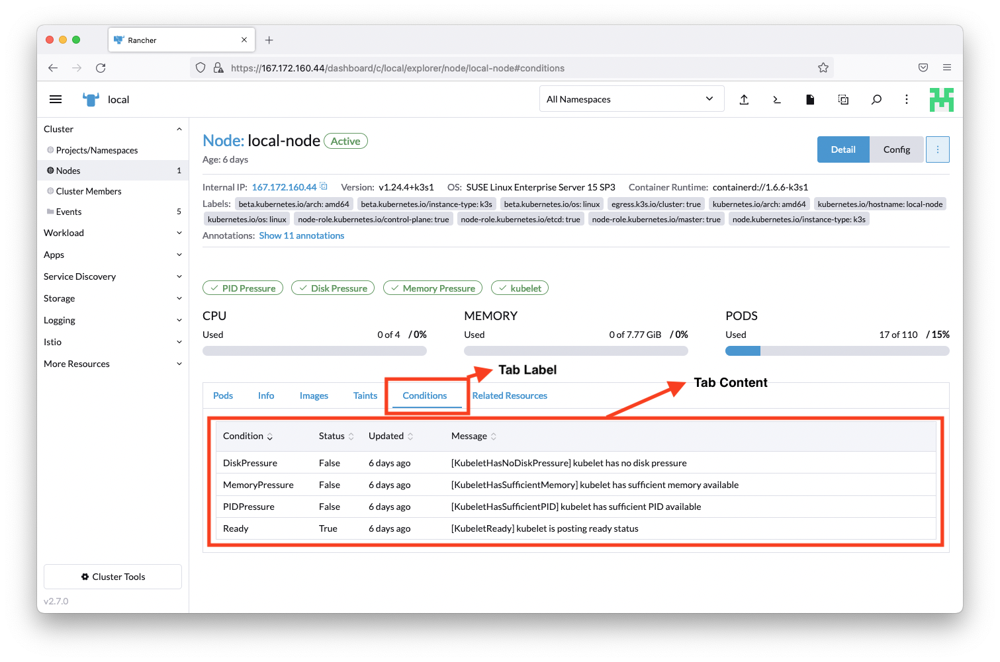
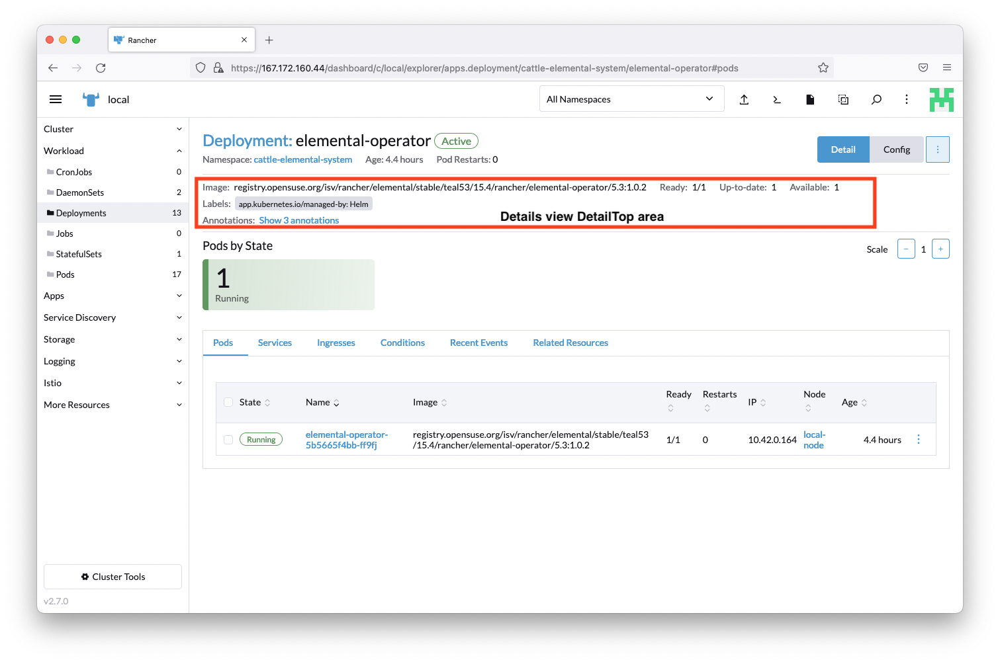

# Extensions API

## Introduction

Rancher Extensions provides a mechanism to add new functionality to the Dashboard UI at runtime. This is covered mostly by the Extensions API which provides several methods on the `plugin` object to enhance the Rancher Dashboard UI in key areas of the interface. They should be defined where the extension is initialized.

Mostly, these methods will need 3 arguments:

**where** - this defines which area of the UI the extension method will apply to.

**when** - this defines the exact product, resource, cluster, mode, etc, which the extension method will apply to and it's based on a `LocationConfig` object, which is explained on the next chapter.

**options** - set of options needed for each specific method.

Example: 

```
plugin.addPanel(
  where,
  when,
  options
```

or

```
plugin.addPanel(
  PanelLocation.DETAIL_TOP,
  { resource: ['catalog.cattle.io.clusterrepo'] },
  { component: () => import('./DetailTopComponent.vue') });
```

<br/>
<br/>

## `where` string definition

The `where` defines which area of the UI the extension method will apply to and they depend on which method they are applied to. This means that each method will only accept a given subset of the the following list (documented per each method).

The admissable string values for the `where` are:

| Key | Type | Description |
|---|---|---|
|`ActionLocation.HEADER`| String | Location for an action on the Header of Rancher Dashboard. Check [screenshot](#where-header-option-for-addaction) for location. |
|`ActionLocation.TABLE`| String | Location for an action on a List View Table of Rancher Dashboard. Check [screenshot](#where-table-option-for-addaction) for location. |
|`TabLocation.RESOURCE_DETAIL`| String | Location for a Tab on a Resource Detail page. Check [screenshot](#where-resourcetabs-option-for-addtab) for location. |
|`PanelLocation.DETAILS_MASTHEAD`| String | Location for a panel on the Details Masthead area of a Resource Detail page. Check [screenshot](#where-detailsmasthead-option-for-addpanel) for location. |
|`PanelLocation.DETAIL_TOP`| String | Location for a panel on the Detail Top area of a Resource Detail page. Check [screenshot](#where-detailtop-option-for-addpanel) for location. |
|`PanelLocation.RESOURCE_LIST`| String | Location for a panel on a Resource List View page (above the table area). Check [screenshot](#where-listview-option-for-addpanel) for location. |
|`CardLocation.CLUSTER_DASHBOARD_CARD`| String | Location for a card on the Cluster Dashboard page. Check [screenshot](#where-clusterdashboard-option-for-addcard) for location. |
|`TableColumnLocation.RESOURCE`| String | Location for a table column on a Resource List View page. Check [screenshot](#where-listview-option-for-addtablecolumn) for location. |

<br/>
<br/>

## `LocationConfig` object definition (`when`)

The `LocationConfig` object defines **when** (product, resource, cluster...) these UI enhancement methods are applied on the UI. The **when** is based on the current routing system employed on Rancher Dashboard. Let's take on a simple example to try and understand the routing structure.

Example URL:
```
<INSTANCE-BASE-URL>/dashboard/c/local/explorer/apps.deployment/cattle-system/rancher-webhook
```

How to recognize the URL structure on the example above:

```
<INSTANCE-BASE-URL>/dashboard/c/<CLUSTER-ID>/<PRODUCT-ID>/<RESOURCE-ID>/<NAMESPACE-ID>/<ID>
```

**Note:** There are Kubernetes resources that aren't namespaced, such as `catalog.cattle.io.clusterrepo`, and in those cases the following structure applies:

```
<INSTANCE-BASE-URL>/dashboard/c/<CLUSTER-ID>/<PRODUCT-ID>/<RESOURCE-ID>/<ID>
```

There is another different routing pattern for "extensions as products" which follows a slightly different convention of the core Rancher Dashboard routes. An example of this would be:

```
<INSTANCE-BASE-URL>/dashboard/elemental/c/local/elemental.cattle.io.machineinventory/nvxml-6mtga
```

which translates to:

```
<INSTANCE-BASE-URL>/dashboard/<PRODUCT-ID>/c/<CLUSTER-ID>/<RESOURCE-ID>/<ID>
```

With this it's then possible to easily identify the parameters needed to populate the `LocationConfig` and add the UI enhancements to the areas that you like. YES, it's possible to also even enhance other extensions!


The admissable parameters for the `LocationConfig` object are:

| Key | Type | Description |
|---|---|---|
|`product`| Array | Array of the product identifier. Ex: `fleet`, `manager` (Cluster Management), `harvesterManager` (Virtualization Management), `explorer` (Cluster Explorer) or `home` (Homepage) |
|`resource`| Array | Array of the identifier of the kubernetes resource to be bound to. Ex: `apps.deployment`, `storage.k8s.io.storageclass` or `secret`  |
|`namespace`| Array | Array of the namespace identifier. Ex: `kube-system`, `cattle-global-data` or `cattle-system` |
|`cluster`| Array | Array of the cluster identifier. Ex: `local` |
|`id`| Array | Array of the identifier for a given resource. Ex: `deployment-unt6xmz` |
|`mode`| Array | Array of modes which relates to the type of view on which the given enhancement should be applied. Admissable values are: `edit`, `config`, `detail` and `list` |

### Examples

Example 1:
```
{}
```

Passing an empty object as a `LocationObject` will apply a given extension enhancement to all locations where it can be apllied.

Example 2:
```
{ product: ['home'] }
```

Extension enhancement will be applied on the homepage of rancher dashboard (if applicable).

Example 3:
```
{ resource: ['pod'], id: ['pod-nxr5vm'] }
```

Extension enhancement will be applied on the resource `pod` with id `pod-nxr5vm` (if applicable).

Example 4:
```
{ 
  cluster:  ['local'], 
  resource: ['catalog.cattle.io.clusterrepo]', 
  mode:     ['edit'] 
}
```

Extension enhancement will be applied on the `edit` view/mode of the resource `catalog.cattle.io.clusterrepo` inside the `local` cluster (if applicable).

<br/>
<br/>

## Extension API methods

### **`addAction`**
This method adds a button/action to the UI.

Method:

```
plugin.addAction(where: String, when: LocationConfig, options: Object)
```

_Arguments_

`where` string parameter admissable values for this method:

| Key | Type | Description |
|---|---|---|
|`ActionLocation.HEADER`| String | Location for an action on the Header of Rancher Dashboard |
|`ActionLocation.TABLE`| String | Location for an action on a List View Table of Rancher Dashboard |

<br/>

`when` Object admissable values:

`LocationConfig` as described above for the [LocationConfig object](#Locationconfig-object-definition).

<br/>
<br/>

#### `'ActionLocation.HEADER'` options


`options` config object. Admissable parameters for the `options` with `'ActionLocation.HEADER'` are:

| Key | Type | Description |
|---|---|---|
|`tooltip`| String | Text for tooltip of button |
|`tooltipKey`| String | Same as "tooltip" but allows for translation. Will superseed "tooltip" |
|`shortcut`| String | Shortcut key bindings. Passed as a string (ex: m), for which the default will be `Ctrl+m` for Linux/Windows and `Meta+m` for Mac OS. Check examples below |
|`icon`| String | icon name (based on [rancher icons](https://rancher.github.io/icons/)) |
|`svg`| Function | icon based on a SVG file which can be included using `@require` |
|`enabled`| Function | Whether the action/button is enabled or not |
|`invoke`| Function | function executed when action/button is clicked |

Usage example for `'ActionLocation.HEADER'`:

```
plugin.addAction(
  ActionLocation.HEADER,
  {},
  {
    tooltipKey: 'plugin-examples.header-action-one',
    tooltip:    'Test Action1',
    shortcut:   'm',
    icon:       'icon-pipeline',
    invoke(opts: any, resources: any) {
      console.log('action executed 1', this); // eslint-disable-line no-console
      console.log(opts); // eslint-disable-line no-console
      console.log(resources); // eslint-disable-line no-console
    }
  }
);
```

```
plugin.addAction(
  ActionLocation.HEADER,
  {},
  {
    tooltipKey: 'plugin-examples.header-action-two',
    tooltip:    'Test Action2',
    shortcut:   'b',
    svg:        require('@pkg/test-features/icons/rancher-desktop.svg'),
    enabled(ctx: any) {
      return true;
    },
    invoke(opts: any, resources: any) {
      console.log('action executed 2', this); // eslint-disable-line no-console
      console.log(opts); // eslint-disable-line no-console
      console.log(resources); // eslint-disable-line no-console
    }
  }
);
```

<br/>
<br/>

#### `'ActionLocation.TABLE'` options

_INLINE TABLE ACTION_


_BULKABLE/GLOBAL TABLE ACTION_


`options` config object. Admissable parameters for the `options` with `'ActionLocation.TABLE'` are:

| Key | Type | Description |
|---|---|---|
|`label`| String | Action label |
|`labelKey`| String | Same as "label" but allows for translation. Will superseed "label" |
|`icon`| String | icon name (based on [rancher icons](https://rancher.github.io/icons/)) |
|`svg`| Function | icon based on a SVG file which can be included using `@require` |
|`divider`| Boolean | Shows a line separator (divider) in actions menu |
|`multiple`| Boolean | Whether the action/button is bulkable (can be performed on multiple list items) |
|`invoke`| Function | function executed when action/button is clicked |


Usage example for `'ActionLocation.TABLE'`:

_RENDERING A SIMPLE DIVIDER_

```
plugin.addAction( 
  ActionLocation.TABLE,
  { resource: ['catalog.cattle.io.clusterrepo'] }, 
  { divider: true });
```


_CONFIGURING A NON-BULKABLE ACTION (inline action)_

```
plugin.addAction(
  ActionLocation.TABLE,
  { resource: ['catalog.cattle.io.clusterrepo'] }, 
  {
    label:    'some-extension-action',
    labelKey: 'plugin-examples.table-action-one',
    icon:     'icon-pipeline',
    invoke(opts: ActionOpts, values: any[]) {
      console.log('table action executed 1', this, opts, values); // eslint-disable-line no-console
    }
  }
);
```


_CONFIGURING AN INLINE AND BULKABLE ACTION_

```
plugin.addAction(
  ActionLocation.TABLE,
  { resource: ['catalog.cattle.io.clusterrepo'] }, 
  {
    label:    'some-bulkable-action',
    labelKey: 'plugin-examples.table-action-two',
    svg:      require('@pkg/test-features/icons/rancher-desktop.svg'),
    multiple: true,
    invoke(opts: ActionOpts, values: any[]) {
      console.log('table action executed 2', this); // eslint-disable-line no-console
      console.log(opts); // eslint-disable-line no-console
      console.log(values); // eslint-disable-line no-console
    },
  }
);
```

### **`addTab`**
This method adds a tab to the UI.

Method:

```
plugin.addTab(where: String, when: LocationConfig, options: Object)
```

_Arguments_

`where` string parameter admissable values for this method:

| Key | Type | Description |
|---|---|---|
|`TabLocation.RESOURCE_DETAIL`| String | Location for a Tab on a Resource Detail page |

<br/>

`when` Object admissable values:

`LocationConfig` as described above for the [LocationConfig object](#Locationconfig-object-definition).

<br/>
<br/>

#### `'TabLocation.RESOURCE_DETAIL'` options



`options` config object. Admissable parameters for the `options` with `'TabLocation.RESOURCE_DETAIL'` are:

| Key | Type | Description |
|---|---|---|
|`name`| String | Query param name used in url when tab is active/clicked |
|`label`| String | Text for the tab label |
|`labelKey`| String | Same as "label" but allows for translation. Will superseed "label" |
|`weight`| Int | Defines the order on which the tab is displayed in relation to other tabs in the component |
|`showHeader`| Boolean | Whether the tab header is displayed or not |
|`tooltip`| String | Tooltip message (on tab header) |
|`component`| Function | Component to be rendered as content on the tab |

Usage example:

```
plugin.addTab( 
  TabLocation.RESOURCE_DETAIL,
  { resource: ['pod'] }, 
  {
    name:       'some-name',
    labelKey:   'plugin-examples.tab-label',
    label:      'some-label',
    weight:     -5,
    showHeader: true,
    tooltip:    'this is a tooltip message',
    component:  () => import('./MyTabComponent.vue')
  }
);
```


### **`addPanel`**
This method adds a panel/content to the UI.

Method:

```
plugin.addPanel(where: String, when: LocationConfig, options: Object)
```

_Arguments_

`where` string parameter admissable values for this method:

| Key | Type | Description |
|---|---|---|
|`PanelLocation.DETAILS_MASTHEAD`| String | Location for a panel on the Details Masthead area of a Resource Detail page |
|`PanelLocation.DETAIL_TOP`| String | Location for a panel on the Detail Top area of a Resource Detail page |
|`PanelLocation.RESOURCE_LIST`| String | Location for a panel on a Resource List View page (above the table area) |

<br/>

`when` Object admissable values:

`LocationConfig` as described above for the [LocationConfig object](#Locationconfig-object-definition).

<br/>
<br/>

#### `'PanelLocation.DETAILS_MASTHEAD'` options


`options` config object. Admissable parameters for the `options` with `'PanelLocation.DETAILS_MASTHEAD'` are:

| Key | Type | Description |
|---|---|---|
|`component`| Function | Component to be rendered as content on the "detail view" Masthead component |

Usage example for `'PanelLocation.DETAILS_MASTHEAD'`:

```
plugin.addPanel(
  PanelLocation.DETAILS_MASTHEAD
  { resource: ['catalog.cattle.io.clusterrepo'] },
  { component: () => import('./MastheadDetailsComponent.vue') });
```

<br/>
<br/>

#### `'PanelLocation.DETAIL_TOP'` options



`options` config object. Admissable parameters for the `options` with `'PanelLocation.DETAIL_TOP'` are:

| Key | Type | Description |
|---|---|---|
|`component`| Function | Component to be rendered as content on the "detail view" detailTop component |

Usage example for `'PanelLocation.DETAIL_TOP'`:

```
plugin.addPanel(
  PanelLocation.DETAIL_TOP,
  { resource: ['catalog.cattle.io.clusterrepo'] },
  { component: () => import('./DetailTopComponent.vue') });
```

<br/>
<br/>

#### `'PanelLocation.RESOURCE_LIST'` options


`options` config object. Admissable parameters for the `options` with `'PanelLocation.RESOURCE_LIST'` are:

| Key | Type | Description |
|---|---|---|
|`component`| Function | Component to be rendered as content above a table on a "list view" |

Usage example for `'PanelLocation.RESOURCE_LIST'`:

```
plugin.addPanel(
  PanelLocation.RESOURCE_LIST,
  { resource: ['catalog.cattle.io.app'] },
  { component: () => import('./BannerComponent.vue') });
```

<br/>
<br/>

### **`addCard`**

This method adds a card element to the UI.

Method:

```
plugin.addCard(where: String, when: LocationConfig, options: Object)
```

_Arguments_

`where` string parameter admissable values for this method:

| Key | Type | Description |
|---|---|---|
|`CardLocation.CLUSTER_DASHBOARD_CARD`| String | Location for a card on the Cluster Dashboard page |

<br/>

`when` Object admissable values:

`LocationConfig` as described above for the [LocationConfig object](#Locationconfig-object-definition).

<br/>
<br/>

#### `'CardLocation.CLUSTER_DASHBOARD_CARD'` options


`options` config object. Admissable parameters for the `options` with `'CardLocation.CLUSTER_DASHBOARD_CARD'` are:

| Key | Type | Description |
|---|---|---|
|`label`| String | Card title |
|`labelKey`| String | Same as "label" but allows for translation. Will superseed "label" |
|`component`| Function | Component to be rendered aas content of a "Cluster Dashboard Card" |

Usage example for `'CardLocation.CLUSTER_DASHBOARD_CARD'`:

```
plugin.addCard(
  CardLocation.CLUSTER_DASHBOARD_CARD,
  { cluster: ['local'] },
  {
    label:     'some-label',
    labelKey:  'generic.comingSoon',
    component: () => import('./MastheadDetailsComponent.vue')
  }
);
```

<br/>
<br/>

### **`addTableColumn`**

This method adds a table column to a `SortableTable`/`ResourceList` element-based table on the UI.

Method:

```
plugin.addTableColumn(where: String, when: LocationConfig, options: Object)
```

_Arguments_

`where` string parameter admissable values for this method:

| Key | Type | Description |
|---|---|---|
|`TableColumnLocation.RESOURCE`| String | Location for a table column on a Resource List View page |

<br/>

`when` Object admissable values:

`LocationConfig` as described above for the [LocationConfig object](#Locationconfig-object-definition).

<br/>
<br/>

#### `'TableColumnLocation.RESOURCE'` options


`options` config object. Admissable parameters for the `options` with `'TableColumnLocation.RESOURCE'` are:

| Key | Type | Description |
|---|---|---|
|`name`| String | Label for column |
|`labelKey`| String | Same as "name" but allows for translation. Will superseed "name" |
|`value`| String | Object property to obtain the value from |
|`getValue`| Fuction | Same as "value", but it can be a function. Will superseed "value" |
|`width`| Int | Column width (in px). Optional |
|`sort`| Array | Object properties to be bound to the table sorting. Optional |
|`search`| Array | Object properties to be bound to the table search. Optional |

Usage example for `'TableColumnLocation.RESOURCE'`:

```
plugin.addTableColumn(
  TableColumnLocation.RESOURCE,
  { resource: ['configmap'] },
  {
    name:     'some-prop-col',
    labelKey: 'generic.comingSoon',
    getValue: (row: any) => {
      return `${ row.id }-DEMO-COL-STRING-ADDED!`;
    },
    width: 100,
    sort: ['stateSort', 'nameSort'],
    search: ['stateSort', 'nameSort'],
  }
);
```


