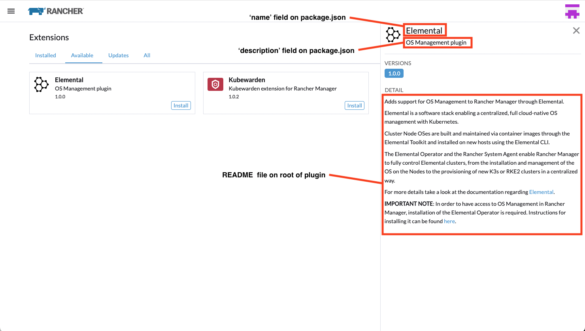

# Metadata

Extensions need to provide metadata so that can it be displayed in the Rancher UI.

This is done my setting the `metadata` property on the `plugin` object that is passed to the init function for an extension package.

This should pull metadata from the extension's `pacakge.json` file, for example:

```ts
import { importTypes } from '@rancher/auto-import';
import { IPlugin } from '@shell/core/types';

// Init the package
export default function(plugin: IPlugin) {
  // Auto-import model, detail, edit from the folders
  // importTypes(plugin);

  // Provide extension metadata from package.json
  plugin.metadata = require('./package.json');

}
```

In addition, if you add a `README.md` file to your extension root folder, it's content will be used to populate the `detail` portion of the product description.

Example of extension metadata shown in the Rancher Extensions UI:


