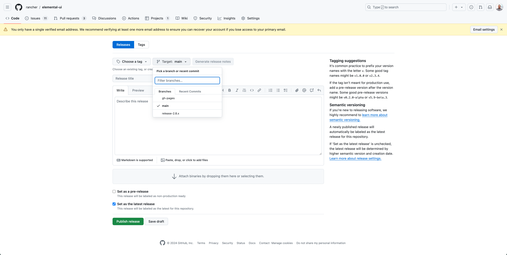

# Rancher 2.9.0 update

## Breaking Changes in 2.9.0

Some of the changes introduced in Rancher 2.9.0 may cause problems with existing UI Extensions. You should check that your UI Extension(s) continue to operate correctly, if they encounter issues, your Extension(s) are most likely affected by the changes below and you should follow the steps below to update them.

Two key changes were made that can affect UI Extensions:

- “Schema diet initiative” changes. The API that the UI uses to understand which schemas (resources) are available was changed such that it now only returns the top-level schema metadata. A new API was added to retrieve the full scheme definition for a given resource type. This will affect UI Extensions that take advantage of this directly or which use the YAML resource editing for a resource type.

- “defineComponent” changes. The use of `defineComponent` was introduced in 2.9.0 as part of the migration to Vue 3. Due to a way in which Vue is exposed in older versions of Rancher, some UI Extensions may experience compatibility issues at load time.

To support these changes we have made some important changes to Rancher Shell (our core JS package) which helps and protects version compatibility.

## Shell Versioning

Before Rancher 2.9.0 was released, the latest stable Shell version was `0.5.3`. From Rancher 2.9.0 we have updated the Shell versioning system in the following way:


Effectively, we have split Shell into two different versions:

- `1.2.3` - which is compliant with any **pre-2.9.0** Rancher system (effectively should be the same as using `0.5.3`).

- `2.0.1` - which is compliant and **needed** for a **2.9.0** Rancher system

For future releases of your extension to **work on Rancher 2.9.0** you will need to build and release a new version of your extension using Shell `2.0.1`.

> If your extension is using Shell `0.5.3` and you **don't need** to be compliant with Rancher 2.9.0, there's no update to do.

These changes bring Shell versions in line with standard versioning patterns. Only major version updates are expected to contain breaking changes, minor and patch versions should not.

## How to update your extension for Rancher 2.9.0

- In the root of your extension repository, update `package.json` `@rancher/shell` to the new `2.0.1` version and `yarn install` to fetch it. Then do a local build of your extensions and `Developer Load` them on the desired Rancher version to confirm everything works as expected. Check documentation about a Developer Load [here](./extensions-getting-started#test-built-extension-by-doing-a-developer-load).

- Before publishing it, add annotation(s) to your extension `pkg/<-YOUR EXTENSION->/package.json` like:

```json
{
  "name": "your-extension",
  "description": "your-extension description",
  "version": "1.2.1",
  "rancher": {
    "annotations": {
      "catalog.cattle.io/rancher-version": ">= 2.9.0",
      "catalog.cattle.io/ui-extensions-version": ">= 2.0.1"
    }
  },
  ....
}
```

> With these annotations your extension will be restricted to Rancher version greater or equal to `2.9.0` and will also be restricted to a UI Extensions version (Shell version) greater or equal to `2.0.1`.  
These are not mandatory but highly recommended to ensure your extension versions reference Rancher / Shell versions they're compatible with.  
For more information about the annotation we allow for, check the documentation [here](./extensions-configuration#configurable-annotations).

- After the above steps, just publish a new version of the extension. That published version should now be compliant with Rancher 2.9.0.

## How to maintain different extension versions

In terms of development procedure, we do recommend that you branch your extension repository so that you can have one branch tracking the Rancher "pre-2.9" and the Rancher 2.9 “worlds”, if your extension is affected by the changes. 

You can check the example of `Elemental` where branch `main` is tracking the **Rancher 2.9 compliant version** and `release-2.8.x` branch is tracking everything Rancher "pre-2.9".

The difference between the two branches is some annotations and of course the shell versions being used.

`main`
- https://github.com/rancher/elemental-ui/blob/main/pkg/elemental/package.json#L6-L12
- https://github.com/rancher/elemental-ui/blob/main/package.json#L11

vs `release-2.8.x`
- https://github.com/rancher/elemental-ui/blob/release-2.8.x/pkg/elemental/package.json#L6-L12
- https://github.com/rancher/elemental-ui/blob/release-2.8.x/package.json#L11


The workflow we offer for Github to build and release extensions to the `gh-pages` branch https://extensions.rancher.io/extensions/publishing#triggering-a-github-workflow-on-tagged-release will work just fine, but when doing a tagged release you’ll need to mindful of the target branch you want to release from.



Picking up on the Elemental example, to release a Rancher pre-2.9 compliant version, we would need to target the `release-2.8.x` branch (with the appropriate tag format ex: `elemental-1.3.1-rc9` which is `extensionName-extensionVersion` ) and for Rancher 2.9 you would target the `main` branch as one would normally do in an extension release. We recommend that you don’t trigger both releases at the same time (let one finish first, then trigger the other release).

To find out more about the support matrix for Shell versions in regards to Rancher versions, check the support matrix [here](./support-matrix#shell-support-matrix).
