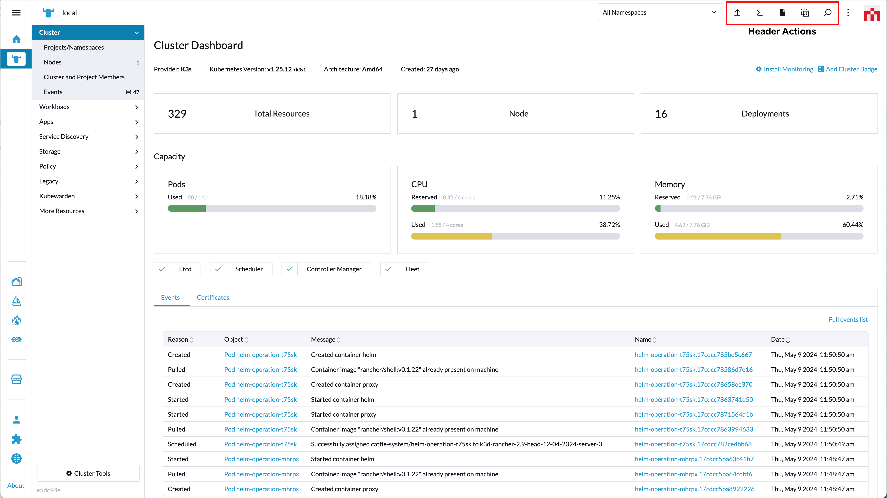
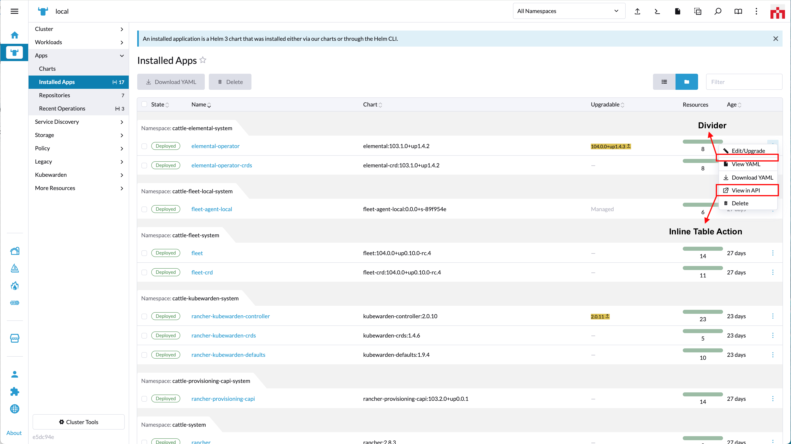
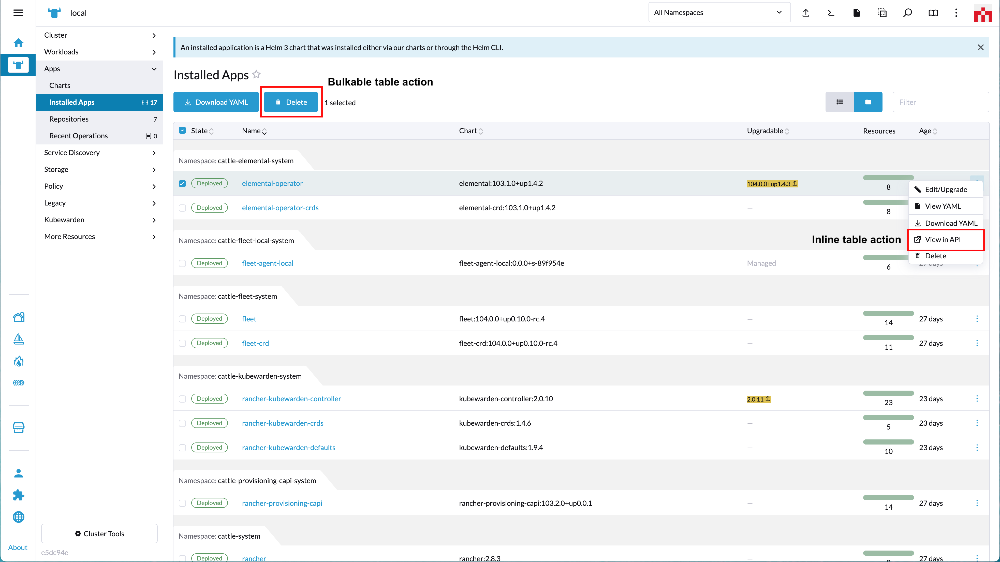

# Actions

An action is typically represented as a button or icon and can be invoked by a user to execute a particular function.

Actions are added to Rancher via the `addAction` method.

## addAction

*(Rancher version v2.7.2)*

This method adds a button/action to the UI.

Method:

```ts
plugin.addAction(where: String, when: LocationConfig, options: Object);
```

_Arguments_

`where` string parameter admissable values for this method:

| Key | Type | Description |
|---|---|---|
|`ActionLocation.HEADER`| String | Location for an action on the Header of Rancher Dashboard |
|`ActionLocation.TABLE`| String | Location for an action on a List View Table of Rancher Dashboard |

<br/>

`when` Object admissable values:

`LocationConfig` as described above for the [LocationConfig object](./common#locationconfig).

<br/>
<br/>

### ActionLocation.HEADER options



`options` config object. Admissable parameters for the `options` with `'ActionLocation.HEADER'` are:

| Key | Type | Description |
|---|---|---|
|`tooltip`| String | Text for tooltip of button |
|`tooltipKey`| String | Same as "tooltip" but allows for translation. Will superseed "tooltip" |
|`shortcut`| String | Shortcut key bindings. Passed as a string (ex: m), for which the default will be `Ctrl+m` for Linux/Windows and `Meta+m` for Mac OS. Check examples below |
|`icon`| String | icon name (based on [rancher icons](https://rancher.github.io/icons/)) |
|`svg`| Function | icon based on a SVG file which can be included using `@require` |
|`enabled`| Function | Whether the action/button is enabled or not |
|`invoke`| Function | function executed when action/button is clicked |

Usage example for `'ActionLocation.HEADER'`:

```ts
plugin.addAction(
  ActionLocation.HEADER,
  {},
  {
    tooltipKey: 'plugin-examples.header-action-one',
    tooltip:    'Test Action1',
    shortcut:   'm',
    icon:       'icon-pipeline',
    invoke(opts: any, resources: any) {
      console.log('action executed 1', this); // eslint-disable-line no-console
      console.log(opts); // eslint-disable-line no-console
      console.log(resources); // eslint-disable-line no-console
    }
  }
);
```

```ts
plugin.addAction(
  ActionLocation.HEADER,
  {},
  {
    tooltipKey: 'plugin-examples.header-action-two',
    tooltip:    'Test Action2',
    shortcut:   'b',
    svg:        require('@pkg/test-features/icons/rancher-desktop.svg'),
    enabled(ctx: any) {
      return true;
    },
    invoke(opts: any, resources: any) {
      console.log('action executed 2', this); // eslint-disable-line no-console
      console.log(opts); // eslint-disable-line no-console
      console.log(resources); // eslint-disable-line no-console
    }
  }
);
```

<br/>
<br/>

### ActionLocation.TABLE options

_INLINE TABLE ACTION_



_BULKABLE/GLOBAL TABLE ACTION_



`options` config object. Admissable parameters for the `options` with `'ActionLocation.TABLE'` are:

| Key | Type | Description |
|---|---|---|
|`label`| String | Action label |
|`labelKey`| String | Same as "label" but allows for translation. Will superseed "label" |
|`icon`| String | icon name (based on [rancher icons](https://rancher.github.io/icons/)) |
|`svg`| Function | icon based on a SVG file which can be included using `@require` |
|`divider`| Boolean | Shows a line separator (divider) in actions menu |
|`multiple`| Boolean | Whether the action/button is bulkable (can be performed on multiple list items) |
|`enabled`| Function | Whether the action/button is enabled or not |
|`invoke`| Function | function executed when action/button is clicked |


Usage example for `'ActionLocation.TABLE'`:

_RENDERING A SIMPLE DIVIDER_

```ts
plugin.addAction( 
  ActionLocation.TABLE,
  { resource: ['catalog.cattle.io.clusterrepo'] }, 
  { divider: true });
```


_CONFIGURING A NON-BULKABLE ACTION (inline action)_

```ts
plugin.addAction(
  ActionLocation.TABLE,
  { resource: ['catalog.cattle.io.clusterrepo'] }, 
  {
    label:    'some-extension-action',
    labelKey: 'plugin-examples.table-action-one',
    icon:     'icon-pipeline',
    enabled(ctx: any) {
      return true;
    },
    invoke(opts: ActionOpts, values: any[]) {
      console.log('table action executed 1', this, opts, values); // eslint-disable-line no-console
    }
  }
);
```


_CONFIGURING AN INLINE AND BULKABLE ACTION_

```ts
plugin.addAction(
  ActionLocation.TABLE,
  { resource: ['catalog.cattle.io.clusterrepo'] }, 
  {
    label:    'some-bulkable-action',
    labelKey: 'plugin-examples.table-action-two',
    svg:      require('@pkg/test-features/icons/rancher-desktop.svg'),
    multiple: true,
    enabled(ctx: any) {
      return true;
    },
    invoke(opts: ActionOpts, values: any[]) {
      console.log('table action executed 2', this); // eslint-disable-line no-console
      console.log(opts); // eslint-disable-line no-console
      console.log(values); // eslint-disable-line no-console
    },
  }
);
```
