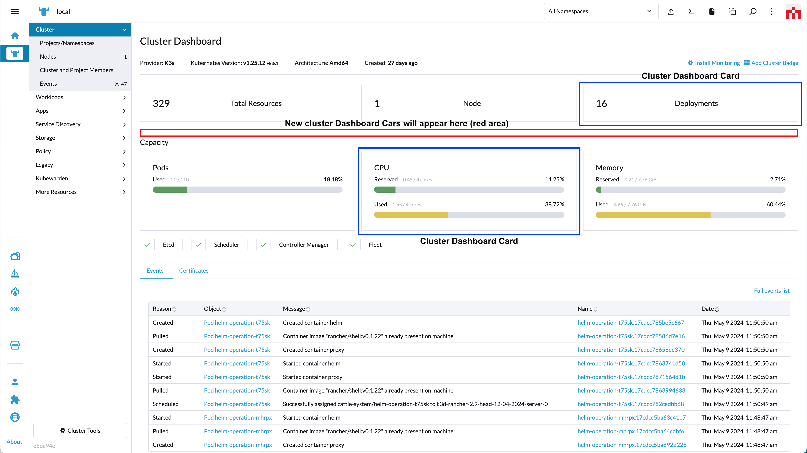

# Cards

Cards present information with a bordered box.

Cards are added to Rancher via the `addCard` method.

# addCard

*(Rancher version v2.7.2)*

This method adds a card element to the UI.

Method:

```ts
plugin.addCard(where: String, when: LocationConfig, options: Object);
```

_Arguments_

`where` string parameter admissable values for this method:

| Key | Type | Description |
|---|---|---|
|`CardLocation.CLUSTER_DASHBOARD_CARD`| String | Location for a card on the Cluster Dashboard page |

<br/>

`when` Object admissable values:

`LocationConfig` as described above for the [LocationConfig object](./common#locationconfig).

<br/>
<br/>

## CardLocation.CLUSTER_DASHBOARD_CARD options



`options` config object. Admissable parameters for the `options` with `'CardLocation.CLUSTER_DASHBOARD_CARD'` are:

| Key | Type | Description |
|---|---|---|
|`label`| String | Card title |
|`labelKey`| String | Same as "label" but allows for translation. Will superseed "label" |
|`component`| Function | Component to be rendered aas content of a "Cluster Dashboard Card" |

Usage example for `'CardLocation.CLUSTER_DASHBOARD_CARD'`:

```ts
plugin.addCard(
  CardLocation.CLUSTER_DASHBOARD_CARD,
  { cluster: ['local'] },
  {
    label:     'some-label',
    labelKey:  'generic.comingSoon',
    component: () => import('./MastheadDetailsComponent.vue')
  }
);
```