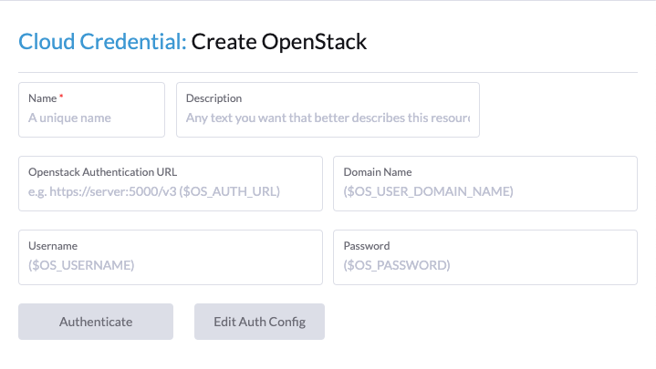

# Cloud Credential

Cloud Credentials store the username & password, or other similar information, needed to talk to a particular provider.  There is typically a 1-to-1 mapping of cloud credentials to drivers.  If one provider (e.g. Amazon) has both a *Machine* driver for RKE (using EC2) and a *Cluster* driver for Kontainer Engine (using EKS) then you can and should use a single shared type of credential (e.g. `aws`) for both.

A cloud credential component for a given driver will be automatically registered when placed in the `cloud-credential` folder and named with the name of the driver (e.g. `openstack.vue`).

> Note: Your extension's entry file must call `importTypes` for the automatic registration to work

The component should be a standard Vue component which displays each field that is relevant to authentication and lets the user configure them.  Only the actual auth fields themselves, the rest of configuring the name, description, save buttons, etc is handled outside of the credential component.

Your component should emit a `validationChanged` event every time a value changes.  It should also (but doesn't _have to_ implement a `test()` method.  This may be asynchronous, and should make an API call or similar to see if the provided credentials work.  Return `true` if they're ok and `false` otherwise.  When provided, this is called before saving and the user won't be able to save until their input causes you return `true`.

The `value` property of the component will be bound to the cloud credential resource.

Other properties:

- `mode` - String mode - can be `view`, `edit` or `create`. Controls should be disabled when in view mode. Controls should be populated from existing values for the view and edit modes.

Example Cloud Credential UI:

